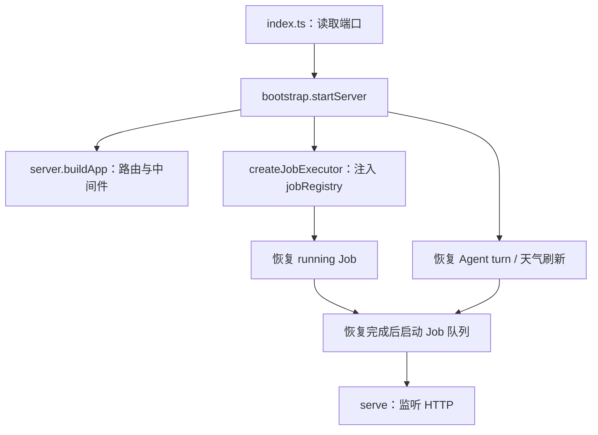

# 后端架构阅读地图

本文描述已落地并完成验收的后端结构。分批重构、review 与验证记录见 [开发计划](design/backend-architecture-refactor.md)。验收中发现的部署问题已通过独立业务提交 `3c55fd2f` 改为按回测报告部署；本文反映该提交后的业务语义。

后端是一个 Hono API 应用，业务代码主要在同一进程内通过函数调用协作；长计算使用 Worker 或子进程，Python 运行由独立 sandboxd 管理。SQLite 通过 Prisma 保存业务与市场数据。目录按业务组织，各模块自己处理权限、状态和事务，不设统一的 controller/service/repository 三层。

## 第一次看项目，从哪里开始

先看 [server.ts](../apps/api/src/server.ts) 找产品接口，再进入对应模块 README 找业务入口。需要理解异步工作时，看 [bootstrap.ts](../apps/api/src/bootstrap.ts) 和 [Job 契约](../apps/api/src/infra/jobs/definition.ts)。只有要修改模拟算法或跨进程协议时，才需要继续进入 Engine、runtime 或 sandboxd。

| 模块 | 拥有什么、服务什么产品操作 | 阅读入口 |
| --- | --- | --- |
| Research | 研究文档、Cell、依赖失效、执行证据、Agent 提案和研究交接 | [Research](../apps/api/src/research/README.md) |
| Factor | 因子定义/组合、分析报告、holdout、发布、持续观察 | [Factor](../apps/api/src/factor/README.md) |
| Strategy | 策略定义、回测报告、参数扫描、报告风险分析 | [Strategy](../apps/api/src/strategy/README.md) |
| Engine | 交易日循环、行情读取端口、成交/持仓和因子求值；供回测和信号计算使用 | [Engine](../apps/api/src/engine/README.md) |
| Signals | 按报告独立部署、每日运行、模拟/人工成交和账户对账 | [Signals](../apps/api/src/signals/README.md) |
| Agent | 模型/工具循环、profile、对话记录、增量事件、工具执行 | [Agent](../apps/api/src/agent/README.md) |
| Market | 数据通道、身份、同步、查询、状态、估值；包含 fundamentals/rates/macro/commodity 四个数据领域 | [Market](../apps/api/src/market/README.md) |
| Maintenance | 整轮数据维护、质量门禁、发布水位、运行锁、审计与恢复 | [Maintenance](../apps/api/src/maintenance/README.md) |
| Sharing | 公开库目录与公开详情，策略复制委托 Strategy | [Sharing](../apps/api/src/sharing/README.md) |
| Auth | 登录、验证码、邀请码、Session 与 Cookie 适配 | [Auth](../apps/api/src/auth/README.md) |
| Infra | 数据库、HTTP 辅助、任务执行器、Python/TS 运行设施、模型/邮件传输和日志 | [Jobs](../apps/api/src/infra/jobs/README.md)、[Runtime](../apps/api/src/infra/runtime/README.md) |
| Math / date.ts / i18n | 共用数值计算、日期和翻译目录；无业务对象或持久化状态 | [math](../apps/api/src/math/)、[date.ts](../apps/api/src/date.ts)、[i18n](../apps/api/src/i18n/) |

`apps/sandboxd` 是独立部署进程，`packages/shared` 提供跨端类型和公开 SDK Contract。它们没有并入 API 的 Infra。一个业务模块也不意味着一个独立服务或数据库。

## HTTP 的入口与内部操作

[server.ts](../apps/api/src/server.ts) 的 `buildApp()` 构造路由与中间件，不监听端口、不启动队列。根级 `/`、`/api/health` 提供存活检查，`/api/auth` 为认证接口，`/api/maintenance` 为维护状态。

`/api/app/*` 先经过维护门禁，再经过鉴权。两者分别从 `maintenance/middleware.ts` 与 `auth/middleware.ts` 导入，不经路由出口转导出。业务操作仍检查资源所有者、当前状态和事务条件；不能把“已登录”等同于“可以修改任意对象”。

| 挂载前缀 | 实际入口 |
| --- | --- |
| `/api/maintenance` | `maintenance/routes.ts` 导出 `maintenanceRoute` |
| `/api/auth` | `auth/routes.ts`；`auth/middleware.ts` 提供鉴权，`auth/cookies.ts` 处理 Cookie |
| `/api/app/research` | `research/routes.ts` |
| `/api/app/factor`、`/api/app/factors`、`/api/app/factor-weather` | `factor/routes.ts` 统一导出 `factorRoute`、`factorsRoute`、`factorWeatherRoute` |
| `/api/app/strategy` | `strategy/routes.ts` 导出 `strategyRoute`；`workbench-routes.ts` 实现并组合 backtest 和 scans 子路由 |
| `/api/app/strategies` | `strategy/routes.ts` 导出 `strategyDefinitionRoute` |
| `/api/app/signals` | `signals/routes.ts` |
| `/api/app/agent` | `agent/routes.ts` |
| `/api/app/market` | `market/routes.ts` |
| `/api/app/library` | `sharing/routes.ts`；URL 保留公开库原契约 |

路由负责入参、用户/语言上下文、HTTP 状态和响应。具体查询与修改在所属模块中；不存在导出整个后端实现的总 service 或 barrel。路由对象使用业务/职责明确的具名导出，如 `authRoute`、`strategyRoute`、`strategyDefinitionRoute` 和 `strategyBacktestRoute`；server 和外部路由消费者只从所属模块的根级 `routes.ts` 同名导入。单组路由可以在入口直接实现，多组路由由入口显式具名转导出，处理器与子路由组合仍按职责分文件实现。组合文件直接导入子路由实现，不反向导入统一出口。

Agent 服务于 Research、Factor 和 Strategy。用户发起业务对话时，前端先调用所属模块的 Agent 入口；业务完成归属和忙碌检查，配置 profile、工具与上下文，再交给通用 Agent。前端之后用 `/api/app/agent` 订阅 SSE、查询 turn、读取历史或取消。Agent 工具按需调用业务操作，业务状态仍由对应模块管理。通用 Agent 还提供只读 SQL、图表工具接口；它不是所有产品操作必须经过的总调度器。

## 启动、装配和运行资源

Bootstrap 是显式装配函数：把业务 Job 的 loader 注册表传给通用执行器，再把执行器传给队列。没有扫描目录、反射或依赖注入容器；新增 Job 需要实现契约并登记 loader。

实际顺序是：构建应用和执行器 → 并行等待 Job、Agent turn、天气刷新恢复 → 发起内置因子种子初始化 → 启动队列 → 监听 HTTP。种子初始化是后台 Promise，不是启动的阻塞步骤；开发环境监听后再异步探测 Python runtime。`buildApp()` 会加载模块、建立模块内对象，不能据此理解为“零对象创建”，但不会开始领取 Job 或监听服务。

| 资源 | 创建与持有者 | 收尾与当前限制 |
| --- | --- | --- |
| API listener | `bootstrap.startServer` 调用 Hono `serve` | 目前只返回 app，没有统一 listener close/stop-drain API；不宣称 API 已有完整优雅退出协议 |
| Job 队列和并发名额 | `infra/jobs/queue.ts`，启动时注入执行器；默认全局 2、每用户 1，可由环境覆盖 | 执行结束释放名额；queued 保存在 DB，running 在重启时恢复；无多实例租约或统一 drain |
| Worker / IPC 子进程 | 各业务任务、工具或维护入口按需创建 | 主线程接收结果并处理退出；具体入口和取消语义见 [运行入口清单](backend-runtime-entries.md) |
| Research Python 会话 | `research/execution/python-session.ts` 按文档复用；公共 session 负责传输 | 中断、reset、归档和执行收尾按业务规则关闭；进程内文档锁不是分布式锁 |
| Factor / Strategy isolate 和 Python 连接 | 各领域 runtime 创建，Infra 提供底层能力 | 调用方在完成/失败时释放；长计算超时策略在各自业务，不由公共传输统一决定 |
| Prisma | `infra/database/prisma.ts` 的进程内单例；子进程有独立实例 | CLI/子进程在收尾断开；API 整体关闭仍依赖进程退出和上级进程管理 |
| Agent bus / trace / 日志 | `agent/turns` 与 `infra/jobs/logs.ts` | DB 保存持久记录，内存事件与日志缓存各有清理规则；重启不重放历史增量事件 |
| Pyright | `research/language/pyright-service.ts` 按需管理语言服务 | 文档和协议生命周期由服务管理；其 package/stub 路径须独立检查 |
| sandboxd 与 runner | 独立 `apps/sandboxd`，API 通过 Unix socket 请求会话 | daemon 处理 SIGINT/SIGTERM、关闭 server 与会话；本地模式和生产隔离模式不可混作同一种验收 |

开发 `pnpm dev` 由 [scripts/dev.mjs](../scripts/dev.mjs) 校验 Python 包、先启动 sandboxd，等待 socket 后再启动 API/Web。退出时给服务进程组发信号、限时等待、再清理残留；它不等于 API 内部的业务事务 drain。API、sandboxd 和开发编排各有自己的资源边界。

## 三条典型业务链

### 1. 修改并执行研究 Cell

1. `research/routes.ts` 调用 `documents/cell-operations.ts`；校验归属、源代码修订和编辑状态，保存 Cell。
2. `dependencies/analyze.ts` / `invalidation.ts` 更新变量关系和下游 stale/blocked；接受 Agent 修改也进入这套业务规则。
3. 用户请求执行后，`execution/run-cell.ts`、`run-document.ts` 或 `run-affected.ts` 取得文档运行锁，选择执行计划和 Python 会话。
4. Python 通过 `sdk/validation.ts` / `dispatch.ts` 请求平台数据，`datasets` 做公开字段/PIT 映射，再查询 Market 或用户报告数据。
5. 执行结果写回 Cell；干净全文执行由 `evidence` 保存 ResearchExecution、快照、产物和哈希，作为后续固化与交接证据。

Research 的交互式 Cell 直接使用会话能力；不必先创建通用 Job。“业务模块直接连接 Python”和“Job Worker 使用 Python”是已有的两条执行路径。接受提案不自动执行，修改源代码也不会改写已冻结证据。

### 2. 提交策略回测并保存报告

1. `strategy/backtest/submit.ts` 处理归属、日期与配置，在事务中创建冻结的 BacktestReport 和 queued Job；提交后才初始化日志并唤醒队列。
2. 队列原子领取 Job，执行器加载 `strategy/backtest-job.ts`，解析持久化输入并启动 `engine/backtest-worker`。
3. Worker 调用 `strategy/execution/run-configured.ts`，准备 Factor 依赖并选择 TS/Python 运行；Engine 用显式 DataPort 读取历史数据、推进模拟。
4. Strategy 在结果上附加风险分析。风险输入序列归 Market，模型与报告解释归 `strategy/analysis/risk`，结果位于回测的多资产配置风险面板。
5. Worker 返回结果并退出；API 主线程的执行器创建 Prisma 事务，把同一个 transaction 交给业务 `complete`，保存报告/相关缓存与 Job 终态。计算与外部调用不占用这个完成事务。

参数扫描使用独立的 `scan-job.ts` 和扫描 Worker，再为各参数 cell fork 子进程，比较冻结范围内的结果。它不是交易标的筛选接口，也不会覆盖当前策略草稿。

### 3. 维护发布数据并生成每日信号

1. Maintenance CLI 通过已有锁进入 daily/weekly/repair；刷新日历、确定数据截止日，按各分支处理补齐、修复或重试。
2. Market 的具体同步函数获取候选数据，按原覆盖规则校验并写库。股票四表、ETF 三表等保留各自的替换事务。
3. 原始质量通过后重算派生指标，再检查派生质量；Maintenance 才推进发布水位或 dataRevision。单项同步成功不等于整轮维护已发布。
4. Signals 读取冻结部署、已发布截止日和因子血缘，创建 SignalRun + Job；其子进程调用 Strategy/Engine 生成下一交易日指令。
5. `signal-job.ts` 在完成事务里保存 SignalRun 与 Job，提交后才初始化账户并通知。记账失败会阻止通知；目前没有 outbox 或持久化 afterCommit 重试。

## 状态与事务归属

| 对象 | 谁拥有状态、关键约束 |
| --- | --- |
| ResearchDocument / Cell | Research 控制修订、失效、阻塞与执行互斥；提交旧修订的结果不能覆盖新源代码 |
| ResearchExecution | Evidence 保存干净完整运行的冻结快照，固化和交接读取证据 |
| Factor / FactorComposite | Factor 控制定义、分析、holdout、发布与归档；Strategy 消费符合已有发布规则的因子 |
| Strategy / BacktestReport / StrategyScanReport | Strategy 保存可编辑草稿和不可混淆的报告快照；提交时冻结配置和数据范围 |
| Job | Infra 拥有 queued → running → done/error/stale；业务任务定义拥有关联业务记录的完成/失败/恢复 |
| AgentTurn / Conversation | Agent 管理对话和消息记录；业务负责上下文。消息完成持久化后才发布 done，多个阶段不是一个总事务 |
| StrategyDeployment / SignalRun / 账户记录 | Signals 从成功 BacktestReport 创建独立部署，拥有运行、人工成交和重放；不同报告可同时运行，后续草稿编辑不改已有部署 |
| MaintenanceRun / MaintenanceState | Maintenance 拥有运行、checkpoint、水位、版本和失败门禁 |

`defineJob()` 是组合式契约，要求 parse / execute / complete / fail / recover，可选 afterCommit。各 `*-job.ts` 使用同一签名；业务不继承一个持有数据库和线程的大 Job 基类。

事务由 Prisma 在同一个 SQLite 连接上管理 BEGIN/COMMIT/ROLLBACK。`complete(transaction, ...)` 的 transaction 由执行器的 `$transaction` 回调提供；业务必须继续使用它，才能让业务结果和 Job 一起提交或回滚。重启恢复在单一事务内按关联 ID 恢复业务记录并标记 running Job stale；queued 不自动丢弃，也不会把中断计算伪装成完成。

并非所有对象共享一个事务：会话创建、模型调用、消息镜像、afterCommit、邮件通知都各有边界。具体事务说明优先看所属模块，不把“用了 Prisma”理解成“整个调用链天然原子”。

## 修改定位与守护规则

| 修改需求 | 先看 |
| --- | --- |
| 改 Cell 失效规则 | `research/dependencies/invalidation.ts`、`run-plan.ts` |
| 改因子发布准入 | `factor/publication/`、`factor/reports/` |
| 找回测报告冻结时点 | `strategy/backtest/submit.ts` 与 `backtest-job.ts` |
| 找每日信号失败收尾 | `signals/signal-job.ts` 与 `infra/jobs/executor.ts` |
| Python 请求财报经过哪里 | `research/sdk/dispatch.ts` → `datasets/financial*.ts` → `market/fundamentals/` |
| 新增行情源 | `market/providers/`、所属数据领域与同步 CLI；同步检查 SQL 白名单和公开 SDK 映射 |
| 改整体审计规则 | `maintenance/data-audit.ts`；模型历史要求由 `strategy/analysis/risk` 提供 |
| 找进程和资源入口 | [运行入口清单](backend-runtime-entries.md)，再看所属领域任务/runtime |

开发时运行 `pnpm check:backend-boundaries`，根级 typecheck/build 已包含此门禁。规则、4 条具名纯依赖例外和验证方法见 [依赖边界说明](backend-boundaries.md)。新增业务能力仍放入负责其状态和规则的模块；不为复用一两个函数新建 common/application 或重新拉出平铺 services。
