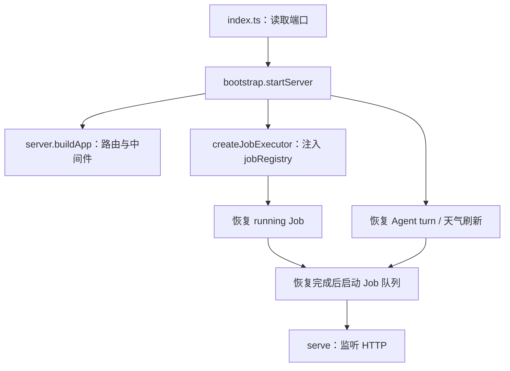

# 后端架构阅读地图

本文描述已落地并完成验收的后端结构。分批重构、review 与验证记录见 [开发计划](design/backend-architecture-refactor.md)。验收中发现的部署问题已通过独立业务提交 `3c55fd2f` 改为按回测报告部署；本文反映该提交后的业务语义。

后端是一个 Hono API 应用，业务代码主要在同一进程内通过函数调用协作；长计算使用 Worker 或子进程，Python 运行由独立 sandboxd 管理。SQLite 通过 Prisma 保存业务与市场数据。目录按业务组织，各模块自己处理权限、状态和事务，不设统一的 controller/service/repository 三层。

## 第一次看项目，从哪里开始

先看 [server.ts](../apps/api/src/server.ts) 找产品接口，再进入对应模块 README，按业务问题选择子能力 README，最后跟随具名入口、直接调用方和测试链接阅读实现。模块总览维护协作关系，子能力维护当前契约，设计文档维护背景与验收历史。需要理解异步工作时，看 [bootstrap.ts](../apps/api/src/bootstrap.ts) 和 [Job 契约](../apps/api/src/infra/jobs/definition.ts)。只有要修改模拟算法或跨进程协议时，才需要继续进入 Engine、runtime 或 sandboxd。

| 模块 | 拥有什么、服务什么产品操作 | 阅读入口 |
| --- | --- | --- |
| Research | 研究文档、Cell、依赖失效、执行证据、Agent 提案和研究交接 | [Research](../apps/api/src/research/README.md) |
| Factor | 因子定义/组合、分析报告、holdout、发布、持续观察 | [Factor](../apps/api/src/factor/README.md) |
| Strategy | 策略定义、回测报告、参数扫描、报告风险分析 | [Strategy](../apps/api/src/strategy/README.md) |
| Engine | 交易日循环、行情读取端口、成交/持仓和因子求值；供回测和信号计算使用 | [Engine](../apps/api/src/engine/README.md) |
| Signals | 按报告独立部署、每日运行、模拟/人工成交和账户对账 | [Signals](../apps/api/src/signals/README.md) |
| Agent | 模型/工具循环、profile、对话记录、增量事件、工具执行 | [Agent](../apps/api/src/agent/README.md) |
| Market | 按数据领域聚合同步/读取/质量；共享日历、身份、通道、跨资产查询与跨市场流程 | [Market](../apps/api/src/market/README.md) |
| Maintenance | 整轮数据维护、质量门禁、发布水位、运行锁、审计与恢复 | [Maintenance](../apps/api/src/maintenance/README.md) |
| Sharing | 公开库目录与公开详情，策略复制委托 Strategy | [Sharing](../apps/api/src/sharing/README.md) |
| Auth | 登录、验证码、邀请码、Session 与 Cookie 适配 | [Auth](../apps/api/src/auth/README.md) |
| Infra | 数据库、HTTP 辅助、任务执行器、Python/TS 运行设施、模型/邮件传输和日志 | [Jobs](../apps/api/src/infra/jobs/README.md)、[Runtime](../apps/api/src/infra/runtime/README.md) |
| Math / date.ts / i18n | 共用数值计算、日期和翻译目录；无业务对象或持久化状态 | [math](../apps/api/src/math/)、[date.ts](../apps/api/src/date.ts)、[i18n](../apps/api/src/i18n/) |

`apps/sandboxd` 是独立部署进程，`packages/shared` 提供跨端类型和公开 SDK Contract。它们没有并入 API 的 Infra。一个业务模块也不意味着一个独立服务或数据库。

## HTTP 的入口与内部操作

[server.ts](../apps/api/src/server.ts) 的 `buildApp()` 构造路由与中间件，不监听端口、不启动队列。根级 `/`、`/api/health` 提供存活检查，`/api/auth` 为认证接口，`/api/maintenance` 为维护状态。

`/api/app/*` 先经过维护门禁，再经过鉴权。两者分别从 `maintenance/middleware.ts` 与 `auth/middleware.ts` 导入，不经路由出口转导出。业务操作仍检查资源所有者、当前状态和事务条件；不能把“已登录”等同于“可以修改任意对象”。

| 挂载前缀 | 实际入口 |
| --- | --- |
| `/api/maintenance` | `maintenance/routes.ts` 导出 `maintenanceRoute` |
| `/api/auth` | `auth/routes.ts`；`auth/middleware.ts` 提供鉴权，`auth/cookies.ts` 处理 Cookie |
| `/api/app/research` | `research/routes/index.ts` 直接组合 document / execution / evidence / proposal / agent / curator / data / language / embedded 路由 |
| `/api/app/factors` | `factor/routes/index.ts` 直接组合定义、组合、Agent、分析、相关性和天气，导出 `factorRoute` |
| `/api/app/strategies` | `strategy/routes/index.ts` 直接组合定义、Agent、回测和扫描，导出 `strategyRoute` |
| `/api/app/signals` | `signals/routes/index.ts` 直接组合 deployment / run / execution 路由 |
| `/api/app/agent` | `agent/routes/index.ts` 直接组合 conversation / turn / chart 路由 |
| `/api/app/market` | `market/routes/index.ts` 直接组合 instrument / valuation / state 路由 |
| `/api/app/library` | `sharing/routes.ts`；URL 保留公开库原契约 |

路由负责入参、用户/语言上下文、HTTP 状态和响应。具体查询与修改在所属模块中；不存在导出整个后端实现的总 service 或 barrel。路由对象使用业务/职责明确的具名导出，如 `authRoute`、`strategyRoute` 和 `factorRoute`；server 和外部路由消费者只从所属模块的路由总入口 同名导入。单组路由可以在入口直接实现，Strategy 的 `routes/index.ts` 直接组合 `routes/definition.ts`、`routes/agent.ts`、`routes/backtest.ts` 和 `routes/scan.ts`；Factor 的 `routes/index.ts` 直接组合 `routes/definition.ts`、`routes/composite.ts`、`routes/agent.ts`、`routes/analysis.ts`、`routes/correlation.ts` 和 `routes/weather.ts`。处理器按业务职责分文件实现。完整路径与迁移说明见 [路由设计](design/api-route-naming.md)。组合文件直接导入子路由实现，不反向导入统一出口。

Agent 服务于 Research、Factor 和 Strategy。用户发起业务对话时，前端先调用所属模块的 Agent 入口；业务完成归属和忙碌检查，配置 profile、工具与上下文，再交给通用 Agent。前端之后用 `/api/app/agent` 订阅 SSE、查询 turn、读取历史或取消。Agent 工具按需调用业务操作，业务状态仍由对应模块管理。通用 Agent 还提供只读 SQL、图表工具接口；它不是所有产品操作必须经过的总调度器。

多组路由统一放在业务模块的 `routes/` 中，由 `routes/index.ts` 组合并对外导出，外部显式导入 `routes/index.js`。实现文件名省略 `-routes` 后缀。业务错误统一放在模块根级 `errors.ts`，公共 HTTP 映射由
`infra/http/errors.ts` 提供，在 `server.ts` 注册 `onError`；公共请求 schema 位于 shared/api；模块根级 `schema.ts` 仅承载后端专属组合和内部输入。
五个核心业务模块的整体接口测试与专属路由测试均放在 `routes/`；其他模块保持现有测试布局。Auth、Sharing、Maintenance
只有单文件路由，直接使用根级 `routes.ts`。HTTP 路径、注册顺序及业务行为保持原契约，整理与验证记录见
[路由目录整理](design/api-route-directories.md)。

## 错误的归属和调用方式

九个业务模块（Strategy、Factor、Research、Signals、Market、Agent、Auth、Sharing、Maintenance）
统一在根级 `errors.ts` 定义错误。业务调用点直接抛出模块错误，例如
`throw new StrategyError('strategy_not_found')`；成功直接返回数据，不以 `null`、`false` 或 `{ error }`
表达操作失败。合法的可选查询、幂等取消结果和任务状态保留数据语义。

`infra/errors.ts` 的 `BusinessError` 保存 reason、category、messageKey、params、details 和 cause，
不包含 HTTP 状态。HTTP 边界统一选择语言和状态，未知异常记录服务端诊断后返回安全的 500；
CLI、Job、Worker 等输出边界通过 `errorMessage` 使用自己的语言。取消、Python 输出、上游重试需要的技术
异常也归所属模块 `errors.ts`，保持原语义。Engine 算法内部的不变量失败继续使用原生 Error，
不创建没有业务拒绝定义的空文件。状态映射、兼容边界及验证记录见 [统一错误约定](design/api-errors.md)。

## 输入 schema 的位置

公共 HTTP body/query/已有 param 的唯一结构来源位于 `packages/shared/src/api/`，按 Auth、Strategy、Factor、Research、
Signals、Agent、Market 拆分；历史图表与消息嵌套规格在同目录的 `chart.ts` / `agent.ts`。API 路由和其他校验边界通过
`@jixie/shared/api/<业务>` 直接导入 schema；前端 `api/client.ts` 只导入请求类型，在序列化前约束完整 body/query。
shared 不导入 API、数据库、Node 专属能力或 SDK 执行器，根级运行时 barrel 不导出这些 schema。

- `z.input` 推导 `*Request` / `*RequestQuery` / `*RequestParams`，描述原始 HTTP 请求；query 中数字为字符串。
- `z.output` 推导具名业务入参；HTTP、Agent 工具和 SDK 适配负责解析外部参数，业务接收默认值与转换后的结果。
- 例如 Factor 创建请求可省略 language，业务入参已有 language；相关性 query 的 keys 是逗号分隔字符串，业务接收数组。
- 后端专属组合留在业务根级 `schema.ts`：Auth 的邀请码规范化；Research 的 SDK 方法与参数校验；Strategy / Factor
  将该校验组合进 Agent / 问答请求；Signals 将解析后 body 与路径 deploymentId 组合成内部业务类型。
- 后端直接消费共享 schema，删除只剩转导出意义的文件；具名类型随实际 schema 归属，不另建集中式 `types.ts`。

归属、权限、冻结、修订、互斥等业务规则保持原位。数据库 JSON、Job/Worker 消息、SDK 参数和 LLM 输出仍是独立读取边界，
不能因为 HTTP 已校验而删除它们的解析。Factor 的历史配置规范化与 Research 继承 parent draft 的数据库解码保持原有职责。
公开 Python SDK Contract、Monaco / Pyright 生成规则也不由 HTTP schema 反向推导。

`pnpm typecheck` 先执行依赖边界和已有 SDK 生成一致性检查，再使用 shared 自身严格配置生成内存声明，按各应用原有配置
进行 noEmit 检查；不依赖陈旧 dist，不运行应用或构建。前端保留 `strictNullChecks: false`，运行时校验仍由 API 执行。
实际构建时仍先构建 shared。

当前实施与验收见 [共享请求契约](design/api-request-contracts.md)；前序整理记录见
[输入 schema 集中整理](design/api-input-schemas.md) 和 [业务输入类型与校验边界](design/api-input-types.md)。

## 启动、装配和运行资源

Bootstrap 是显式装配函数：把业务 Job 的 loader 注册表传给通用执行器，再把执行器传给队列。没有扫描目录、反射或依赖注入容器；新增 Job 需要实现契约并登记 loader。

实际顺序是：构建应用和执行器 → 并行等待 Job、Agent turn、天气刷新恢复 → 发起内置因子种子初始化 → 启动队列 → 监听 HTTP。种子初始化是后台 Promise，不是启动的阻塞步骤；开发环境监听后再异步探测 Python runtime。`buildApp()` 会加载模块、建立模块内对象，不能据此理解为“零对象创建”，但不会开始领取 Job 或监听服务。

| 资源 | 创建与持有者 | 收尾与当前限制 |
| --- | --- | --- |
| API listener | `bootstrap.startServer` 调用 Hono `serve` | 目前只返回 app，没有统一 listener close/stop-drain API；不宣称 API 已有完整优雅退出协议 |
| Job 队列和并发名额 | `infra/jobs/queue.ts`，启动时注入执行器；默认全局 2、每用户 1，可由环境覆盖 | 执行结束释放名额；queued 保存在 DB，running 在重启时恢复；无多实例租约或统一 drain |
| Worker / IPC 子进程 | 各业务任务、工具或维护入口按需创建 | 主线程接收结果并处理退出；具体入口和取消语义见 [运行入口清单](backend-runtime-entries.md) |
| Research Python 会话 | `research/runtime/python-session.ts` 由普通文档、嵌入分析和依赖分析共用，按文档 ID 复用；公共 session 负责传输 | 中断、reset、归档和执行收尾按业务规则关闭；普通文档锁归 `document-runs/run-state.ts`，嵌入分析保留独立取消/超时流程 |
| Factor / Strategy isolate 和 Python 连接 | 各领域 runtime 创建，Infra 提供底层能力 | 调用方在完成/失败时释放；长计算超时策略在各自业务，不由公共传输统一决定 |
| Prisma | `infra/database/prisma.ts` 的进程内单例；子进程有独立实例 | CLI/子进程在收尾断开；API 整体关闭仍依赖进程退出和上级进程管理 |
| Agent bus / trace / 日志 | `agent/turns` 与 `infra/jobs/logs.ts` | DB 保存持久记录，内存事件与日志缓存各有清理规则；重启不重放历史增量事件 |
| Pyright | `research/language/pyright-service.ts` 按需管理语言服务 | 文档和协议生命周期由服务管理；其 package/stub 路径须独立检查 |
| sandboxd 与 runner | 独立 `apps/sandboxd`，API 通过 Unix socket 请求会话 | daemon 处理 SIGINT/SIGTERM、关闭 server 与会话；本地模式和生产隔离模式不可混作同一种验收 |

开发 `pnpm dev` 由 [scripts/dev/dev.mjs](../scripts/dev/dev.mjs) 校验 Python 包、先启动 sandboxd，等待 socket 后再启动 API/Web。退出时给服务进程组发信号、限时等待、再清理残留；它不等于 API 内部的业务事务 drain。API、sandboxd 和开发编排各有自己的资源边界。

## 三条典型业务链

### 1. 修改并执行研究 Cell

1. `research/routes/document.ts` 调用 `documents/cell-operations.ts`；校验归属、源代码修订和编辑状态，保存 Cell。
2. `dependencies/analyze.ts` / `invalidation.ts` 更新变量关系和下游 stale/blocked；接受 Agent 修改也进入这套业务规则。
3. 用户请求执行后，`document-runs/run-cell.ts`、`run-document.ts` 或 `run-affected.ts` 取得文档运行锁，选择执行计划，通过 `runtime/python-session.ts` 获取 Python 会话。嵌入分析共用此会话管理器，保留独立的运行和冻结流程。
4. Python 通过 `sdk/validation.ts` / `dispatch.ts` 请求平台数据，`datasets` 做公开字段/PIT 映射，再查询 Market 或用户报告数据。
5. 执行结果写回 Cell；干净全文执行由 `evidence` 保存 ResearchExecution、快照、产物和哈希，作为后续固化与交接证据。

Research 的交互式 Cell 直接使用会话能力；不必先创建通用 Job。“业务模块直接连接 Python”和“Job Worker 使用 Python”是已有的两条执行路径。接受提案不自动执行，修改源代码也不会改写已冻结证据。

### 2. 提交策略回测并保存报告

1. `strategy/backtests/submit.ts` 处理归属、日期与配置，在事务中创建冻结的 BacktestReport 和 queued Job；提交后才初始化日志并唤醒队列。
2. 队列原子领取 Job，执行器加载 `strategy/backtests/job.ts`，解析持久化输入并启动 `strategy/backtests/worker`。
3. Worker 调用 `strategy/backtests/run.ts`，通过 `strategy/factor-inputs/prepare.ts` 准备 Factor 依赖并选择 TS/Python 运行；Engine 用显式 DataPort 读取历史数据、推进模拟。
4. Strategy 在结果上附加风险分析。风险输入序列归 Market，模型与报告解释归 `strategy/risk`，结果位于回测的多资产配置风险面板。
5. Worker 返回结果并退出；API 主线程的执行器创建 Prisma 事务，把同一个 transaction 交给业务 `complete`，保存报告/相关缓存与 Job 终态。计算与外部调用不占用这个完成事务。

参数扫描使用独立的 `scans/job.ts` 和扫描 Worker，再为各参数 cell fork 子进程，比较冻结范围内的结果。扫描共享因子准备，但 cell 直接调用 `runWalledBacktest`，不经过正式回测编排及风险后处理；Signals 同样只共享因子准备和底层 runtime。它不是交易标的筛选接口，也不会覆盖当前策略草稿。

### 3. 维护发布数据并生成每日信号

1. Maintenance CLI 通过已有锁进入 daily/weekly/repair；调用 Market calendar 刷新日历并按上海 16:00 / SSE 规则确定截止日，按各分支处理补齐、修复或重试。
2. Market 的具体同步函数获取候选数据，按原覆盖规则校验并写库。股票四表、ETF 三表等保留各自的替换事务。
3. 原始质量通过后重算派生指标，再检查派生质量；Maintenance 才推进发布水位或 dataRevision。单项同步成功不等于整轮维护已发布。
4. Signals 读取冻结部署、已发布截止日和因子血缘，创建 SignalRun + Job；其子进程调用 Strategy/Engine 生成下一交易日指令。
5. `runs/job.ts` 在完成事务里保存 SignalRun 与 Job，提交后才初始化账户并通知。记账失败会阻止通知；目前没有 outbox 或持久化 afterCommit 重试。

Market 的同步/读取/基础质量归入所属数据领域，具体入口见模块 README。Signals 的利率依赖解析和 14 天新鲜度政策归 `signals/factor-inputs/rates.ts`；Market 的 `rates/government-yield-availability.ts` 只返回所需期限在交易日已可得的最新日期。日历事实由 `market/calendar` 供 Maintenance 与 Signals 共用，信号下一交易日要求仍归 Signals。

## 状态与事务归属

| 对象 | 谁拥有状态、关键约束 |
| --- | --- |
| ResearchDocument / Cell | Research 控制修订、失效、阻塞与执行互斥；提交旧修订的结果不能覆盖新源代码 |
| ResearchExecution | Evidence 保存干净完整运行的冻结快照，固化和交接读取证据 |
| Factor / FactorComposite | Factor 控制定义、分析、holdout、发布与归档；Strategy 消费符合已有发布规则的因子 |
| Strategy / BacktestReport / StrategyScanReport | Strategy 保存可编辑草稿和不可混淆的报告快照；提交时冻结配置和数据范围 |
| Job | Infra 拥有 queued → running → done/error/stale；业务任务定义拥有关联业务记录的完成/失败/恢复 |
| AgentTurn / Conversation | Agent 管理对话和消息记录；业务负责上下文。消息完成持久化后才发布 done，多个阶段不是一个总事务 |
| StrategyDeployment / SignalRun / 账户记录 | Signals 从成功 BacktestReport 创建独立部署，拥有运行、人工成交和重放；不同报告可同时运行，后续草稿编辑不改已有部署 |
| MaintenanceRun / MaintenanceState | Maintenance 拥有运行、checkpoint、水位、版本和失败门禁 |

`defineJob()` 是组合式契约，要求 parse / execute / complete / fail / recover，可选 afterCommit。各业务目录内的任务定义使用同一签名；业务不继承一个持有数据库和线程的大 Job 基类。

事务由 Prisma 在同一个 SQLite 连接上管理 BEGIN/COMMIT/ROLLBACK。`complete(transaction, ...)` 的 transaction 由执行器的 `$transaction` 回调提供；业务必须继续使用它，才能让业务结果和 Job 一起提交或回滚。重启恢复在单一事务内按关联 ID 恢复业务记录并标记 running Job stale；queued 不自动丢弃，也不会把中断计算伪装成完成。

并非所有对象共享一个事务：会话创建、模型调用、消息镜像、afterCommit、邮件通知都各有边界。具体事务说明优先看所属模块，不把“用了 Prisma”理解成“整个调用链天然原子”。

Research 的冻结研究交接负责证据准入与生成，Factor/Strategy 负责目标复用、命名和写入；模型调用不进入目标保存事务。具体顺序、重试差异和调用入口维护在 [Research handoff](../apps/api/src/research/handoff/README.md)，再由它链接到目标 definitions。

## 修改定位与守护规则

| 修改需求 | 先看 |
| --- | --- |
| 改 Cell 失效规则 | [Research dependencies](../apps/api/src/research/dependencies/README.md) |
| 改因子发布准入 | [Factor publication](../apps/api/src/factor/publication/README.md)、[evaluations](../apps/api/src/factor/evaluations/README.md) |
| 找回测报告冻结时点 | [Strategy backtests](../apps/api/src/strategy/backtests/README.md) |
| 找每日信号失败收尾 | [Signals runs](../apps/api/src/signals/runs/README.md)、[账户重放](../apps/api/src/signals/accounting/README.md) |
| Python 请求财报经过哪里 | [Research SDK](../apps/api/src/research/sdk/README.md) → [datasets](../apps/api/src/research/datasets/README.md) → [Market fundamentals](../apps/api/src/market/fundamentals/README.md) |
| 新增行情源 | `market/providers/`、所属数据领域与同步 CLI；同步检查 SQL 白名单和公开 SDK 映射 |
| 改整体审计规则 | `maintenance/publication/audit.ts`；模型历史要求由 `strategy/risk` 提供 |
| 找进程和资源入口 | [运行入口清单](backend-runtime-entries.md)，再看所属领域任务/runtime |

开发时运行 `pnpm check:backend-boundaries`，根级 typecheck/build 已包含此门禁。规则、4 条具名纯依赖例外和验证方法见 [依赖边界说明](backend-boundaries.md)。新增业务能力仍放入负责其状态和规则的模块；不为复用一两个函数新建 common/application 或重新拉出平铺 services。

## 应用命令入口

Market、Maintenance、Signals、Auth 的命令放在各模块 `cli/`，用法汇总于 [API 命令索引](../apps/api/scripts/README.md)。Market 负责数据和证券代码合并，财报分期、历史导入、分批子进程和质量检查归 fundamentals；Maintenance 负责整轮发布和应用可用性协调。CLI 负责参数/输出/收尾，简单组合保留在入口中；基线修复由 Maintenance 编排，财报历史导入由 Market fundamentals 的具名操作承接。独立备份工具仍在 API scripts 根目录，以 Node 直接执行。

## 核心业务模块的目录规则

Factor、Strategy、Research、Market、Signals 根级保留说明、输入校验和可选的共用业务异常。Agent 启动与上下文归各模块 `agent/`，任务定义归所属业务目录；整体路由测试归 `routes/`。Signals 单次运行及通知归 `runs/`，每日数据准备与批量运行归 `daily/`。Factor 的纯来源类型、解析、快照及语言哈希归 `sources/snapshot.ts`，通用指纹归 `sources/fingerprint.ts`，业务消费者直接引用，不经 Job 实现转导出。其他领域目录按实际业务保留；本规则不要求其他功能模块套用相同结构。

迁移与验证记录见 [核心业务入口整理](design/core-business-entry-points.md)。

## Factor 内部职责

正式报告与 Job、相关性缓存、天气 pin 分属三个生命周期，共享计算不拥有这些对象。入口及协作流程维护在 [Factor 总览](../apps/api/src/factor/README.md)，具体契约见 [evaluations](../apps/api/src/factor/evaluations/README.md)、[correlations](../apps/api/src/factor/correlations/README.md)、[weather](../apps/api/src/factor/weather/README.md) 和 [execution](../apps/api/src/factor/execution/README.md)。旧 Job kind 的部署转换与查询规则见 [jobs](../apps/api/src/factor/jobs/README.md)，背景和历史验证见 [内部结构整理](design/core-business-internal-structure.md)。

## Maintenance 与 Market 数据业务边界

数据的同步、修复、质量阈值和 PIT 检查由 Market 对应子域实现；Maintenance 组合各业务能力，拥有运行恢复、更新顺序、发布门禁和水位。
`maintenance/publication/audit.ts` 汇总报告，具体审计位于 stocks、instruments、indices、fundamentals、macro、cross-market、rates、etfs、commodity；共享结果契约和覆盖摘要在 market/quality，不依赖 Maintenance。
财报 Worker 通过逐项完成消息和父进程确认隔离数据执行与维护 checkpoint；ETF recovery 使用调用方恢复回调。`maintenance/runs/coordination.ts` 提供锁检查与任务安静窗口，其他流程不再从 daily 导入公共协调能力。
详见 [Maintenance 阅读入口](../apps/api/src/maintenance/README.md) 和 [变更记录](design/maintenance-business-boundaries.md)。
