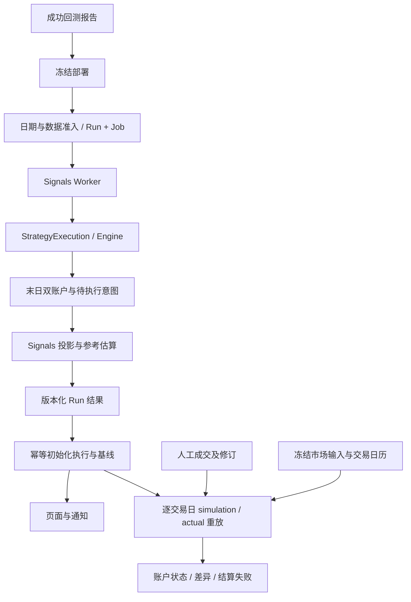

# 期货及混合账户 Signals 详细设计

状态：2026-09-29 用户确认设计及第 10 节推荐决策；产品实现待独立 Gate 1 批准。

日期：2026-09-29。代码核对基线：`521d8df2ab0be96bf897a03bb490e7b4d9a8fa8a`；开始时工作区干净。本次仅新增本文，不运行产品测试、构建、数据库迁移或服务；用户审阅确认后提交本文，不推送。

任务来源：[研究任务说明](futures-signals-research-prompt.md)。工作流：[review-gated-development](/Users/liucong/.codex/skills/review-gated-development/SKILL.md)。本文中的“现状”来自代码静态核对，不等于行为复现；“推荐”“拟新增”均不是已经存在的接口。本文设计提交消息：`docs(signals): design futures and mixed-account signal support`。

## 1. 目标、交付及明确边界

在同一个完整产品变更中，使 Signals 能够生成期货交易意图、展示参考和执行解析结果、模拟成交、录入人工成交、逐日结算并重放双账户，支持纯现金、纯期货和混合策略。完整验收包括数据准备、持久化、Worker、API、界面、通知和中英文帮助，不能只开放部署或显示期货提示。

支持范围以当前 `backtesting/adapters/prisma-port.ts::futuresRange` 为准：IF、IH、IC、IM 四种股指期货的实际月合约与 IF.CFX、IH.CFX、IC.CFX、IM.CFX 连续逻辑代码；人民币、日线、当前引擎交易日口径。商品仅供研究，不因入库而开放交易。不接券商、实时行情、夜盘、自动下单、跨策略资金仲裁、账户间转账或完整 Engine 恢复。Python 策略部署限制继续保留。

延续以下不变量：

- 现金和期货账户始终存在；`accounts` 只配置初始资金，默认 100% / 0%。旧 `futures` 元数据兼容读取但忽略，既不是启用开关也不是完整数据需求。
- 零资金不禁用接口；模拟订单受余额和保证金约束，不能从现金账户自动补充期货资金。
- Engine 推进日期、调用策略、结算；OrderBook 收集并执行意图；账户承担记账。保留现有下单入口及执行顺序。
- AllocationAnalysisTracker 只分析现金账户；总权益增加期货账户权益，但期货名义金额和保证金都不能作为额外资产加到总权益。
- 模型策略继续独立全历史运行，不把 actual 成交回填注入模型策略；三类账户的差异是需要展示的研究结果。

## 2. 当前链路、证据与缺口

### 2.1 关键文件与调用关系

以下路径均相对仓库根目录，符号名供实施时再次定位。

| 现状 | 证据入口 | 对设计的约束 |
| --- | --- | --- |
| 从成功报告冻结部署；拒绝 Python、期货资金和历史期货结果 | [manage.ts](../../apps/api/src/signals/deployments/manage.ts) `deployBacktestReport` | 当前不是按旧 futures 声明拒绝；deployments README 的文字已滞后 |
| 手动提交先全局结算，再进入部署归属检查和入队 | [submit.ts](../../apps/api/src/signals/runs/submit.ts)、[enqueue.ts](../../apps/api/src/signals/runs/enqueue.ts) | 保留现有顺序并记录风险，不借机重构授权边界 |
| 同部署同日 done/running 复用；error/stale 复用 Run、新建 Job | `runs/enqueue.ts`、`runs/state.ts` | 不覆盖已完成且已人工执行的历史信号 |
| Worker 调用 StrategyExecution，取末日状态后投影 | [run.ts](../../apps/api/src/signals/runs/run.ts)、[execution.ts](../../apps/api/src/strategy/execution/execution.ts) | 因子血缘仍在运行前校验，资源在 finally 关闭 |
| 末日状态只有现金账户、现金订单和因子观测 | [result.ts](../../apps/api/src/backtesting/result.ts)、[engine.ts](../../apps/api/src/backtesting/engine.ts) `collectFinalState` | 补双账户及期货意图后才能撤掉 retainFinalState 防护 |
| 正期货资金提前拒绝，运行中收集期货意图也拒绝 | `engine.ts` `initialize` 所在初始化流程、`decide` | 必须同时处理两处保护，不能只改部署入口 |
| 执行顺序为自动换月→现金目标→现金增减→条件单→期货意图 | [order-book.ts](../../apps/api/src/backtesting/order-book.ts) `executeOrders` | hedge 读取现金订单和条件单处理后的敞口 |
| IPC 严格校验 stock/etf 结果 | [worker-protocol.ts](../../apps/api/src/signals/runs/worker-protocol.ts)、[result-schema.ts](../../apps/api/src/signals/runs/result-schema.ts) | 新数据必须贯穿序列化和 schema，不能只修改 TS 类型 |
| Run 保存后，另一步初始化记账，再通知 | [job-lifecycle.ts](../../apps/api/src/signals/runs/job-lifecycle.ts) `onSuccess/onCommitted` | 无跨步骤总事务、无通知 outbox，需幂等恢复 |
| 条件单不创建执行记录 | [initialize.ts](../../apps/api/src/signals/accounting/initialize.ts) | 现有 simulation/actual 都不能提供完整条件成交后敞口 |
| 重放只遍历有 Run 的 execDate | [settlement.ts](../../apps/api/src/signals/accounting/settlement.ts) | 必须改成逐交易日，包括无信号、暂停后仍持仓的日期 |
| actual 必须等 simulation 非 pending，且股数不超过 requestedShares | [executions.ts](../../apps/api/src/signals/accounting/executions.ts) | 动态数量不能沿用该限制；人工成交不能依赖模拟成功 |
| 全量重放先删快照，再逐日事务 | `accounting/settlement.ts` | 失败会留下部分历史；双账户不能以此作为“最新完整结果” |
| quote 只有现金开收盘等字段，replay 只处理现金 | [quotes.ts](../../apps/api/src/signals/accounting/quotes.ts)、[replay.ts](../../apps/api/src/signals/accounting/replay.ts) | 需 OHLC 条件模拟、期货实约价格、结算和保证金输入 |
| readiness 只检查股票四张表非空及独立利率准入 | [readiness.ts](../../apps/api/src/signals/runs/readiness.ts)、`runs/enqueue.ts` | 行数非零不代表具体合约齐备 |
| 日常 Signals 同步没有期货；weekly 刷新合约元数据 | [sync.ts](../../apps/api/src/signals/daily/sync.ts)、`maintenance/workflows/weekly.ts` | 补实际日行情、映射、结算参数和发布检查 |

### 2.2 不应被设计掩盖的现有规则

`FuturesPortfolio.roll` 先读取两腿开盘价，校验合并后的手续费及保证金，再一起修改内存持仓并记两笔交易；缺任一开盘价跳过，保证金不足抛错。它是模拟层的一次整体变更，不表示真实交易两腿原子成交。

`OrderBook.executePendingFutureIntents` 遇到合约变化，先执行平旧；平旧成功且 target 非零才开新。开新失败时平旧不会撤销。带显式意图的逻辑代码会跳过自动换月，退出以 contracts=0 表达。

`FuturesPortfolio.settle` 以当日 settle 更新权益、参考价和保证金；缺结算价或可用余额为负会抛错。保证金比例允许数据源值归一化并回退配置；手续费当前使用配置的统一比例，`futureCloseTodayRate` 未被应用，滑点 tick 固定 0.2。本文不顺带改变这些回测规则，也不宣称已覆盖交易所或券商全部规则。

引擎 hedge 在现金条件单模拟后计算现金敞口，但现金估值优先当日开盘、缺失时截至当日收盘，期货数量和成交仍用当日开盘价。该日线顺序不构成可在开盘实际执行的因果时序。Signals 必须标明此局限，不能把事后解析结果称为开盘前可执行清单。

## 3. 核心决策：保留意图，分开参考、解析和成交

### 3.1 推荐与备选

| 方案 | 优点 | 缺点 | 建议 |
| --- | --- | --- | --- |
| 收盘冻结所有期货手数 | 清单简单，沿用现有表单较容易 | 跳空、现金未成交、条件触发后 hedge 均失真；目标型接口语义改变 | 不推荐 |
| 保存原意图，收盘估算，按账户执行状态解析 | 保留作者语义，可解释模型/实际偏差，支持换月和部分成交 | 需要解析记录、人工上下文及依赖状态 | 推荐，待确认 |
| 实时自动跟踪并执行 | 可在真实时序自动计算数量 | 需要实时数据与券商接入，超出当前研究定位 | 排除 |

推荐四层对象：不可变的 `intent`；信号日生成的 `reference`；带账户、价格和数据依据的 `resolution`；不可由重算覆盖的 `fill`。参考数量永远不能作为实际成交数量的上限。

### 3.2 各种期货意图的明确含义

`q` 是该账户当前有符号持仓手数，`p` 是目标实际合约解析价格，`m` 是合约乘数；取整保持当前向零截断，不改成四舍五入。目标与成交增量分开存储。

| 意图 | 目标手数 | 依赖 | 零值与失败 |
| --- | --- | --- | --- |
| delta | trunc(q + delta) | 当前账户持仓；必要时合约迁移 | 零增量按既有收集规则；不把未成交量自动延期 |
| contracts | trunc(targetContracts) | 当前持仓、目标合约 | 0 是退出，保留显式退出以抑制自动换月 |
| notional | trunc(targetNotional / (p × m)) | 解析价格、乘数、映射 | 参考和最终手数可能不同；缺价不是零手 |
| hedge | trunc(-beta × cashExposure / (p × m)) | 相应账户现金成交、条件单结果、估值依据 | beta=0 表示零目标；依赖未确认时 waiting，不输出假精确指令 |
| 自动换月 | 保持本账户旧仓手数，平旧开新 | 持仓、先前已知映射、执行日、两腿行情 | 没有显式意图也产生换月任务；两腿关联且各有状态 |

方向有两个维度：交易 `buy/sell` 和持仓动作 `open/close`，另存 `positionSide=long/short`。例如 buy 可为开多也可为平空。跨零反手拆为平仓和开仓两腿，不用单个 side 隐藏效果。数量是正整数 contracts，有符号数只用于目标与净持仓。

### 3.3 三套账户和具体时序

D 收盘：模型全历史执行至 D，结算后 onBar 留下意图；冻结 D 的双账户状态、原意图、映射证据与参考估算。D+1 不要求已有任何行情才能生成 D 的信号。

D+1 simulation：按已发布的 D+1 日线、simulation 前态执行自动换月、现金普通单、现金条件单，再解析期货目标，最后结算。保留现有回测时点规则，标记为日线模拟结果。

D+1 actual：用户先记录实际现金成交和条件成交/未执行，再显式确认本次对冲使用的已知持仓与价格。系统给出解析清单；用户自行交易，录入实际合约、手数、价格、费用、成交时间及顺序。后续现金变化只提示对冲差异，不自动修改已经执行的期货，也不生成隐含补单。

实际对冲上下文冻结 `exposureAsOf`、持仓版本、现金估值价格及来源、期货参考报价及其时间；这是用户提供或已发布的数据，不伪称实时行情。若只在盘后回填，允许直接录入已发生的成交并注明执行依据未知；完整结算数据到位后重放，不能要求先有模拟成交。

model 参考从模型账户生成；simulation 从自己的累计成交状态解析；actual 从已记录实际状态和明确的解析上下文计算。同一意图可有不同目标，不把 model 手数直接复制到另外两套账户。

### 3.4 数量和换月例子

下列均为合成示例，不是市场参数建议；为说明数量，暂忽略费用。

- 名义目标 2,400,000，乘数 300，D 收盘 4,000：参考 2 手。D+1 开盘 4,100：trunc(2,400,000 / 1,230,000)=1 手。保存 2 手参考和 1 手模拟解析；人工可按自己的价格记录实际数量，不报“超过参考手数”。
- hedge beta=1，模型现金敞口 3,600,000、期货价 4,000、乘数 300：参考 -3 手。现金买入不足后 simulation 敞口 2,400,000，解析为 -2 手；actual 仅形成 1,200,000，人工解析为 -1 手。三种结果各自有证据，原 beta 不变。
- 连续代码当前持有旧合约 -2 手，映射指向新合约：自动换月展示“买入平空旧合约 2 手 → 卖出开空新合约 2 手”。人工只平旧 1 手时，旧仓仍有 -1；可实际开新 1 手并同时持有两个月份。actual 必须按实际合约分仓，不能继续用逻辑代码唯一键。
- 显式退出时同代码不自动换月；模型空仓仍保留零目标意图，actual 若因历史未执行而有仓，解析为平实际仓。若 actual 同逻辑代码有多个合约，逐合约退出；不凭空开反向仓。
- 普通意图只适用于目标执行日，未成交部分当日终止；下一日只应用新意图。跨日残留是持仓、条件单或待补录事实，不是自动延续的市价订单。跨日真实补成交须有实际日期和偏离说明，不能改写原 execDate。

## 4. 双账户末日状态与模块复用

### 4.1 内部快照

推荐 `BacktestingFinalState` 改为带 `schemaVersion: 2` 的组合结构，由 Engine 负责组合，账户和 OrderBook 各自提供深拷贝。完整快照使用数组/普通对象、有限数值和字符串，可 JSON 往返；不带 Map、类、DataPort、闭包或可变引用。

| 分组 | 必需字段及语义 |
| --- | --- |
| 时间 | tradeDate、最后结算日；期货执行日由 Signals 日历决定，不能从未来价格推导 |
| cashAccount | cash、equity、复权持仓及 T+1 冻结信息；现金订单沿用既有语义 |
| futuresAccount | settledEquity、margin、availableCash；每仓 code、actualCode、有符号 contracts、multiplier、referencePrice、margin、settlementDate |
| orders.cash | targets 的 null/空集合区别、share/lot orders、decisionDate、持续条件单及其创建日、高水位 |
| orders.futures | 每个逻辑代码的最终 FutureIntent、decisionDate、稳定序号；保留覆盖和 delta 累加规则 |
| market.cash | 复权/真实收盘价、复权因子、assetType 与实际价格日期 |
| market.futures | 实际合约身份、乘数、上市/退市日、D 的价格与结算数据、映射日期/候选持仓量/来源 |
| factorObservations | 保留末日因子读取观测，不把期货交易元数据塞入因子描述 |

`snapshotCashOrders()` 保留原导出及深拷贝语义；增加窄的 `snapshotFuturesOrders()`，Engine 把两者转换成序列化快照。不得暴露整个 PendingOrders。`hasCollectedFuturesOrders` 在迁移期间维持拒绝；新消费者和协议全部就绪后移除该拒绝，若查询没有其他生产消费者则删除该 getter 及专属测试，而非留下无意义开关。

这是末日投影输入，不是恢复检查点：不保存用户策略闭包、因子运行缓存、历史 NAV、Tracker 状态、Worker 生命周期或随机状态，不提供 resumeEngine API。

### 4.2 复用范围

建议在 `backtesting` 内抽取窄的期货纯计算（拟 `futures-accounting.ts`、`futures-orders.ts`），由 FuturesPortfolio 和 Signals 调用：

- 目标手数解析：显式传入当前手数、价格、乘数和现金敞口，不读取数据库。
- 成交记账：显式传入实际合约、买卖/开平、手数、成交价、费用和保证金比例，返回新账户及变动明细；只算账，不决定是否实际成交。
- 结算计算：输入持仓、当日结算价和保证金依据，返回权益、保证金、变动盈亏与 margin-call 状态。
- 费用、保证金比例归一化和参考价更新仅保留一个公式来源；模拟适配器负责滑点及可成交判断，actual 直接用人工成交价和费用，不调用 `executeOrder` 重新开盘定价。

FuturesPortfolio 保持类和既有公开行为；模拟成交前仍做余额检查；结算纯函数返回风险状态后，原 Engine 适配器继续按当前规则抛错。Signals 可记录实际已经发生的亏损和负可用余额并显示风险，不因模拟保证金规则静默丢弃人工事实。该差异必须显式测试。

实际账户允许同逻辑代码多个 actualCode。纯账本按 actualCode + 持仓方向处理，逻辑 code 是归属标签；本次仅支持净仓，不开放同一实际合约同时多空锁仓。多个逻辑代码指向同一实约时保留来源分配，平仓不得超过对应归属可平量；无法归属时要求用户选择，不重复计算保证金。

现金条件单必须进入新版记账：提取现有 OrderBook 条件选择/价格/高水位规则为共用纯函数，复用已有现金费用、T+1/T+0、滑点和公司行动单位换算。Signals 仍拥有每日重放，不加载策略 runtime，不伪造 Engine 恢复。普通现金信号继续按参考股数执行，保留现有目标权重近似；新版条件单生命周期是为准确现金敞口必需的扩展，不能继续仅作展示。

## 5. 公开契约、解析与成交模型

### 5.1 版本化公开结果

在 `packages/shared/src/signals.ts` 定义 cash/future 可辨识联合；HTTP 入参只在 `packages/shared/src/api/signals.ts` 定义。内部 Prisma 模型不反向生成公开类型。`runs/result-schema.ts` 与 IPC schema 覆盖所有分支及版本，旧无版本 JSON 按 v1 解码，未知版本明确拒绝。

拟新增概念字段：

| 对象 | 主要字段 |
| --- | --- |
| SignalIntent | id、sequence、assetType、code、decisionDate、execDate、source、原始目标/增量/条件定义 |
| FuturesSignalReference | mappingEvidence、actualCode、referencePrice/date、multiplier、referenceTargetContracts、referenceLegs、referenceNotional、referenceMargin、assumptions |
| SignalResolution | id、intentId、accountKind、revision、accountRevision、status、resolvedAt、priceBasis、exposureBasis、mappingEvidence、legs、dependencyIds |
| ExecutionLeg | id、resolutionId、groupId、legIndex、dependsOnLegId、actualCode、side、positionEffect、positionSide、contracts、multiplier |
| ActualFill | id、legId、clientRequestId、executedAt、tradeDate、sequence、contracts/shares、price、fee、reason、revision/void 状态 |
| AccountSnapshotV2 | cashAccount、futuresAccount、totalEquity、输入版本、结算日期、完整性/风险状态 |

cash 分支用 shares，future 分支用 contracts；future 不允许填 shares，也不把零参考手数理解为无意图。金额、保证金和权益均人民币；名义金额注明绝对额和有符号净额，保证金必须非负。tradeDate 是交易日期，executedAt 是带时区时间，recordedAt 是录入时间，不混用。

意图状态与成交状态分离：解析 `waiting/ready/no_action/blocked/expired`；成交汇总 `pending/partial/filled/skipped`。`partial` 由有效 fill 累计量派生，允许多笔成交。自动换月 group 下两腿有明确关联；已平旧/未开新是可表达的中间状态。

### 5.2 人工解析和录入接口

保留现有查询路由和 v1 `PATCH /executions/:executionId`。拟在 `/api/app/signals` 增加：

- `POST /executions/:executionId/resolutions`：对 actual 解析；输入 expectedAccountRevision、价格/敞口时点、现金及条件任务确认、clientRequestId。落盘固定解析证据，返回明确腿，不发送订单。
- `POST /executions/:executionId/fills`：录入实际成交；必须归属本人部署，输入腿/实约、数量、成交价、费用、时间、expectedRevision、clientRequestId。无现成解析时可记录有解释的偏离成交，服务端创建带事实依据的腿，不编造旧解析。
- `PATCH /fills/:fillId`：修订或撤销，保留审计版本；触发从最早受影响交易日起的重放。
- `POST /deployments/:deploymentId/account-replays`：本人显式重试结算/重放失败；不重新执行策略、不重发交易通知。

正常录入的实约必须属于允许产品及所选逻辑代码，开平和数量符合已记录持仓。超参考量允许并标偏离；超可平量或实际同合约锁仓拒绝并说明当前支持范围，不静默截断。历史修订导致后续平仓不成立时标记冲突并停止发布新账户版本，保留全部成交原始记录供修正。

actual 不再依赖 simulatedStatus；但缺结算行情时只保存成交事实并标 account pending/failed，不声称已完成对账。费用推荐作为期货成交必填字段；旧现金记录缺费用仍按原规则估算并标明来源。

### 5.3 条件单与缺失信号日

新版冻结条件单稳定身份（部署、代码、条件种类、创建版本）和每日条件集合。相邻成功 Run 给出集合的替换/取消，高水位则在各自 simulation 生命周期内更新；actual 由人工确认挂单、成交或取消，不能因 simulation 触发而自动成交。

同一存续条件不能每天生成重复实际成交任务。产生一次触发/人工成交后记为消费；新策略声明形成新版本。没有新 Run 的日子仅延续已经生效的条件，逐日结算既有持仓；不凭空调用策略补决策，显示“缺少该日模型信号”。

hedge 有当日条件依赖时，人工解析要求确认本次敞口截止时点之前的条件执行情况；未完成的后续条件仍可能改变敞口，页面显示这种剩余风险，不暗示当天敞口已永久确定。

## 6. 持久化、兼容与幂等

### 6.1 数据库变更建议

保留已有表及 ID，不把历史 JSON 原地解释为期货数据。

| 表 | 拟变更 |
| --- | --- |
| StrategyDeployment | accountingVersion 默认 1，新部署显式 2；accountInputRevision、当前发布账户 generation/revision、dirtyFromDate、replayStatus/error；不是资产启用开关 |
| SignalRun | resultVersion、modelAccounts、intentSnapshot、referenceSnapshot、marketEvidence；旧 modelCash/modelPositions 保留现金含义，modelEquity 表示总权益 |
| SignalExecution | 保留原意图行；新增 deploymentId、execDate、intentId、version、intent JSON、taskKey；signalRunId/signalIndex 变可空以承载无 Run 的自动换月；现金旧数量列变可空，期货不填股数；run/index 唯一关系保留用于初始意图，另设 deployment/taskKey 唯一键 |
| SignalResolution（新） | executionId、kind、revision、inputHash、context JSON、legs JSON、status；唯一 execution/kind/revision |
| SignalFill（新） | execution/resolution/leg 关系、userId、clientRequestId、revision、实际成交字段、撤销与修订链；用户/请求标识唯一 |
| SignalAccountMarketInput（新） | deploymentId、tradeDate、version、输入 JSON/hash、来源及 observedAt；冻结重放所需最小行情，不复制整个市场数据库 |
| StrategyAccountSnapshot | version、generation、双账户 JSON、风险/完整性、inputHash；v2 唯一 deployment/kind/generation/date，旧数据 generation=0 |

解析腿保存在 versioned JSON，fill 按 legId 关联并由业务层校验归属；若实现选择独立腿表，必须在 Gate 1 更新准确 schema 范围。每项 JSON 都有读取时 schema 校验，不再用 unchecked cast 或损坏数据回退空持仓。无 Run 执行任务通过部署账户查询返回；新增 `GET /deployments/:deploymentId/executions` 查询含自动维护任务的完整列表，新录入接口返回 execution 与账户重放状态，不再强制返回某个 SignalRun。旧 PATCH 仅处理有 Run 的 v1 行。

账户写入修订号及 dirtyFromDate 与成交写入在同一个短事务完成。派生快照用新 generation 生成，整段成功后短事务 compare-and-swap 发布 generation；失败保留旧结果并明确 stale。不能先删除当前可见结果。

同部署的 simulation 和 actual 使用一致输入截止与独立状态；actual 修订只使 actual 派生结果失效，不改模型和 simulation。最终实现可分别保存两种 kind 的发布指针，不能因 actual 失败隐藏已验证 simulation。

### 6.2 历史兼容与迁移

- 旧部署 accountingVersion=1，继续原现金参考数量和条件展示语义，不静默重算历史。新部署统一 v2，纯现金也可使用新版条件记账；界面标明差异。升级旧部署通过暂停后从报告重新部署，建立独立基线。
- 旧 Run 无 resultVersion 按现金 v1 读取；旧 execution 的 requestedShares、人工汇总成交继续支持。迁移不凭历史 shares 猜测 contracts、不从旧 futures 字段推导资金。
- 旧 execution 的 deploymentId/execDate 从所属 Run 确定性回填，taskKey 从 runId/signalIndex 派生。新增归属列先允许 null，由幂等数据迁移填充并检查无孤儿后收紧；迁移工具用 Prisma/应用代码执行回填，不手改生成 SQL。新版创建必须完整写入，旧行兼容读取期间可经 Run 查询归属。
- 旧账户无 futuresAccount 时归一化成零期货账户，旧 cash/equity 数值保持。冻结股数兼容规则保持；未知或损坏 JSON 明确报不可读取，不能吞成空仓。
- 旧历史的行情没有 vintage，不能承诺按“当时数据”重放。新版首次冻结输入之后保证同输入同结果；补录早于冻结覆盖范围时明确提示并记录本次取数版本。
- Prisma schema 是内部持久化真相；公开 API 联合由 shared 显式定义。本次新表包含用户账户数据，绝不能加入 SQL_TABLE_DOCS 白名单。
- 用 Prisma 生成 migration，不手写或改历史 SQL。审查前先提供 schema 与不连接数据库的 Prisma schema diff 生成 SQL；审查后在临时库用 `migrate dev --create-only` 核对，若生成物差异涉及语义，重新审查。升级验证覆盖旧库、空库、唯一约束及回滚备份恢复。
- API/Shared/Web 同批发布；维护窗口暂停任务接纳并等待现有 Worker 退出，备份后迁移再发布。旧前端刷新，不做新旧 IPC 混跑。回退代码前先核对 schema/新记录兼容；无法兼容则用维护窗口备份恢复，不强行让旧代码读新期货记录。

### 6.3 重复运行、恢复和并发

同部署同日已完成 Run 仍直接返回；只有 error/stale 的未完成尝试可以复用 Run。人工成交存在时禁止把该 Run 当失败草稿清空。未来若需要重算完成信号，必须新建显式版本，本文不提供该操作。

原意图 ID 基于 run + 稳定 sequence，初始化按唯一键逐条 upsert，不再依赖“已存在任何 execution 就跳过全部”。基线按 deployment/kind 唯一，重复 afterCommit、进程重启或日常结算可以幂等补齐。Run 计算 done 与 accounting ready 分开显示；初始化失败不得显示账户正常。

录入 clientRequestId 重试返回原结果；相同 key 不同内容返回冲突。expectedRevision 防止双窗口覆盖。重放在事务外计算，每日候选写入和最终发布都检查输入修订；新成交使旧重放失效，旧 Worker 不能覆盖新状态。仅内存 mutex 不足以跨进程保证正确性。

保留既有 Job attempt 防护及结果→初始化→通知顺序。本次不新增通知 outbox；通知失败继续可见，不回滚信号。账户恢复重试不再次发出同一交易清单。

## 7. 逐日账户重放与财务语义

### 7.1 基线与日历

首次成功信号 D 的现金/期货模型状态作为 simulation 和 actual 的共同“模型继承基线”，冻结结算参考价和保证金。actual 仍是从模型基线出发的人工成交影子账，不是已经接入的券商账户；界面必须明确说明，真实账户导入和资金存取不在范围内。

从基线下一交易日至 throughDate 逐日枚举日历，而非枚举 Run。暂停不停止持仓结算。没有当日意图就不产生普通成交；仍执行已生效条件、计算换月候选和期货结算。自动换月任务允许 sourceRunId 为空，记录最近模型意图和账户持仓来源，不能虚造 SignalRun；为此执行任务存储需允许独立的部署/日期归属及唯一键。

该无 Run 自动换月是账户维护动作：simulation 沿用引擎规则，actual 只形成待确认任务而不记成交。有该日新 Run 时按逻辑代码显式意图抑制自动换月；补到的历史 Run 若改变已经产生的任务，仅标冲突并要求审查，不覆盖人工历史。

### 7.2 记账公式与顺序

每个交易日：加载并冻结输入 → 自动换月 → 现金普通/条件成交 → 期货显式意图解析和模拟成交，或应用按真实时间排序的人工成交 → 每日结算 → 双账户快照。actual 用真实成交顺序，不能沿用当前一律先卖后买的排序，因为换月、反手及多次成交依赖先后。

- 期货账面权益 E 是结算后资金，不扣除已占保证金；可用资金 A=E−M。
- 平仓实现盈亏：平仓手数 × 原持仓方向 × (成交价−referencePrice) × multiplier；费用从 E 扣除。
- 同方向加仓加权更新 referencePrice；减仓保留剩余仓参考价；反手先结清旧方向，再按新成交价建立新方向。
- 每日盯市：E += signedContracts × (settle−referencePrice) × multiplier；然后 referencePrice=settle，按结算价重算 M。同一交易日重复结算不可二次计入。
- 总权益=现金账户现金+现金证券市值+期货 E；期货名义敞口=signedContracts×估值价×multiplier。保证金不是损失，名义额不是权益。
- 实际费用显式输入；模拟费用/滑点沿用冻结 cost。记录每笔来源，不能用后来的费率刷新历史成交。

### 7.3 缺失、风险和失败

缺实际合约行情、settle、身份或未批准的保证金依据时，该日结算失败，停在最后完整日期；不能用下一日数据、最新映射或 0 替代。已保存人工成交不丢失，派生账户标 stale，补数据后重试同一输入版本或显式创建修订版本。

simulation 保证金不足按对应入口原规则处理：普通单 rejected/blocked；自动换月整体失败；显式平旧成功开新失败保留平仓结果。Engine 结算 margin call 的抛错保持；Signals 保存风险诊断并不发布“正常完成”的后续模拟账户。

actual 的负可用资金是待处理事实，记录权益和缺口，不自动强平/转账。到期无法换月或实际合约超出最后可处理日期时显示 unresolved expiry，停止声称后续账户完整；不编造交割价。真实交割结算和强平导入需要另立范围。

## 8. 数据准备、PIT 与发布门禁

### 8.1 需求集合

不能用 futures 数组或 cashWeight 推断需求。同步覆盖四种已支持产品在目标区间存续的实际合约、连续映射及到期替代候选；结算额外包含所有未平 simulation/actual 合约，包括 paused 部署。这样动态下单代码也不会逃过准入，纯现金账户无实际需求时不强制期货成交数据完整。

入队做静态基础门禁；Worker 基于真实最终持仓和意图做精确门禁。对模型历史执行中实际触及的期货代码、日期及映射建立读取证据，不能只验证末日而任由历史缺数据静默漏单。实现采用 Signals 提供的严格数据访问适配，保持普通回测现有缺数据行为；不可通过源码字符串扫描保证完整性。

### 8.2 按阶段检查

| 阶段 | 必需输入 | 新鲜度与失败规则 |
| --- | --- | --- |
| D 信号生成 | 合约身份/乘数/上市退市日，D 以前映射与替代候选 D 持仓量，模型历史所需价格；末日估算价及已持仓结算价 | 不读取 D+1 价格；映射应有 D 的已发布覆盖，停更明确报错，不无限沿用陈旧映射 |
| D+1 simulation | 冻结映射依据、D+1 精确开盘/OHLC、当日 settle、保证金依据、现金公司行动和日历 | 缺数据与行情存在但不可成交分开；缺数据失败，不标普通 blocked |
| actual 解析 | 确认的持仓版本、现金估值与期货报价及时间 | 用户输入明确来源；不能用盘后值冒充盘前可得 |
| actual 结算 | 实际持有合约的精确 settle、乘数、保证金依据 | 不受是否有新 Run/active 部署限制；覆盖暂停持仓 |

复用 [market/futures/sync.ts](../../apps/api/src/market/futures/sync.ts) 的合约、daily、mapping、settlement 同步。`signals/daily/sync.ts` 编排需求，`maintenance/workflows/daily.ts` 在发布前做完整性检查并冻结通过的集合；手动生成只读已发布数据。逐合约同步事务本身不等于整日发布成功；中途失败不推进期货水位，不允许 Worker 读到半套候选数据。

拟新增按期货数据集的发布日期/输入摘要，不能把股票水位直接当期货水位。需要维护流程在 signals 重试分支也检查该水位。Market 负责数据事实与发布快照，Signals 负责业务所需集合，两者不能形成反向导入。

保证金推荐保留配置回退，但必须冻结 `source=data|config` 并显式显示“模型保证金”；如果要求真实交易所比例则启用本次设计决策中的严格模式，缺值报错，不猜值。手续费暂用已支持成本模型，并明确不等于实际券商费用。

当前数据按交易日存储，没有完整发布时刻/vintage。本文的 PIT 保证是代码不读未来交易日，并冻结首次使用证据；不能追溯证明所有历史供应商修订当时可得。需在报告中说明，不能用新的 capturedAt 给旧数据伪造 availableAt。

交易日先与当前 Engine 的 SSE 日历对齐，并验证所支持股指合约在每个执行日有数据；不默认为任意期货共用 SSE。若发现股指与当前日历不一致，应阻断该日期并重新确认日历范围，不以本次改动扩展夜盘/其他市场。

## 9. 页面、通知、统计与帮助

主要入口仍为 `apps/web/src/complex/signals/`，请求在 `apps/web/src/api/signals.ts`，中英文 signals 命名空间同步。使用现有 MobX complex、LoaderModel、antd 表单/表格、BEM CSS 与 ECharts；不新增独立交易终端。

- 部署卡显示模型总权益和现金/期货分账户资金；旧部署标“旧版现金记账”，actual 标“模型基线 + 已录入成交”。
- 现金股数、期货手数分列；期货展示逻辑代码、实际合约、买卖、开平、多空、参考/解析/实际数量、名义敞口与保证金。不得沿用“市值”显示保证金。
- 动态 hedge 行展示 beta、依赖任务及“待确认现金敞口”；未解析不出现可以误读成已定数量的执行按钮。收盘参考即使是 0 手也保留意图。
- 换月以分组展示两腿状态，可录入部分成交；只平旧成功时明确显示尚未开新和剩余旧仓。
- 成交表单支持多笔、整数手、成交时间、实际合约、费用及偏离原因；参考值只辅助填入，不自动确认。actual 录入成功但重放失败时分别反馈，提供重试入口。
- 账户曲线区分 model/simulation/actual，显示最后完整结算日、stale/失败原因和保证金缺口；旧 generation 不可伪装成最新。
- 股票股数与期货手数不能混加。执行率分资产/任务统计，部分成交单独展示；价格偏差仅在同实际合约、同买卖方向的可比成交之间计算，跨换月合约不计算虚假偏差。总权益可比较，归因仍仅现金账户。
- 通知保留空信号、成功、失败三类，但含 waiting 意图或自动换月任务不能发送“今日无操作”。写明参考时点和动态数量，通知不当作最终成交清单；不发送真实邮件做测试。

同步 `apps/docs/src/content/help/{zh,en}/signals/` 的 deploy-strategy、read-signals、record-execution、conditional-orders、generate-signals、history-pause，补充期货/混合账户说明与链接；Strategy SDK 公开方法不改，但现有期货方法文档须解释 Signals 的参考和执行时点局限。同步模块 README、daily-signals 和本设计验收记录，清除已不适用的“期货全部不支持”描述，保留历史记录的时间语境。

## 10. 待用户拍板的决策

以下产品语义推荐项已于 2026-09-29 获用户确认。实现 Gate 1 沿用这些选择，不重复请求同一语义批准；若新证据要求改变选择，再说明影响并重新确认。

| 决策 | 推荐 | 备选与代价 |
| --- | --- | --- |
| 动态信号 | 原始意图 + 参考估算 + 分账户解析 | 冻结手数更简单，但改变 notional/hedge 含义，不满足原任务语义 |
| hedge 人工时点 | 以用户确认时点的实际敞口/报价解析，明确与日线模拟时点不同 | 改成严格开盘前敞口需要修改策略/回测语义，应另案设计，不能顺手改 |
| 条件单记账 | v2 纳入模拟和人工成交生命周期，作为混合 hedge 的必要闭环 | 保持仅展示则无法声称混合账户完整，需限制受影响策略 |
| 初始 actual 状态 | 明确沿用冻结模型双账户基线 | 真实券商基线导入、存取款与完整对账会扩大范围 |
| 保证金数据 | 允许冻结成本配置回退并标模型来源；身份、价格、settle 不回退 | 严格要求源保证金，覆盖不齐时拒绝信号/结算；更保守但更多数据阻断 |
| actual 事实与风险 | 允许已发生事实形成负可用余额，显示缺口；不自动强平 | 直接拒绝所有超模拟余额成交会导致实际账失真 |
| 重放一致性 | 本次纳入修订号、generation 发布与幂等录入 | 沿用删除后逐日重建会继续暴露半成品账户，不推荐 |

无论如何选择，本次不自动引入保证金追加、强平、实物交割或实时重平衡。如需这些能力，重新审查范围。

## 11. 完整影响范围与实施安排

文档批准后，推荐单个完整功能提交：`feat(signals): support futures and mixed-account execution`。该消息目前是实施提案，需在 Gate 1 与最终范围一并确认；不是本次文档提交消息。

以下是一个变更内部的依赖顺序，不是逐步发布或交付半成品：

1. 定义并贯通 v2 结果、意图、解析、成交和账户契约及兼容读取；新增 Prisma schema 与生成迁移材料。
2. 抽取必要的期货计算与条件执行规则；补末日双账户快照、市场证据及 StrategyExecution/Worker 传输。
3. 实现按真实合约的人工账、模拟解析、逐日结算、最小输入冻结、generation 发布与并发保护。
4. 完成数据需求、同步/发布和精确准入、历史/暂停账户恢复；初始化和重试幂等。
5. 完成表单、双账户展示、动态意图/换月通知、统计及中英文帮助。
6. 全链路就绪后移除部署和 retainFinalState 的期货拒绝；保留 Python 限制及其他准入。
7. 静态检查、人工代码审查，再执行约定行为验收和构建，全部通过才提交。

| 模块 | 主要文件/新增位置 |
| --- | --- |
| Backtesting | engine.ts、result.ts、order-book.ts、futures-portfolio.ts、cash-portfolio.ts、data/engine-data.ts；拟新增 futures-accounting.ts/futures-orders.ts 与窄条件计算 |
| Strategy | execution/execution.ts 结果契约及测试；runtime bridge/SDK 仅在内部类型消费需要时适配，不改公开下单签名 |
| Signals | deployments/manage/read；runs/projection/run/result-schema/worker-protocol/job-lifecycle/enqueue/read/notifier；accounting 全链路；拟新增 resolution/fill/input-snapshot/replay-publication 职责文件 |
| Shared / HTTP | signals.ts、api/signals.ts；Signals 路由、业务 errors 和双语消息映射 |
| 数据与调度 | market/futures、signals/daily、maintenance/workflows/daily、publication 检查与发布状态；市场持久化变更时同步 SQL_TABLE_DOCS，用户输入快照不入白名单 |
| 数据库 | schema.prisma、Prisma 生成迁移、隔离迁移 fixture；不修改历史 migration |
| 前端与文档 | complex/signals、api/signals、zh/en signals、Lab 部署提示及帮助页面、各 README |
| 验证设施 | 同目录单测/集成测试、tests/job-worker-protocol.test.ts、web/e2e 与隔离 fixture |

不新增 deployable workspace，不改变跨包构建依赖；若实现需要新增部署单元或跨包依赖，必须同步 `deploy/component-impact.json` 和 `scripts/deploy/plan-deployment.test.mjs`。若触及 Python 打包资源，需额外同步部署清单及镜像输入；本设计不计划这种改动。

## 12. 检查与验收矩阵

### 12.1 静态检查（产品代码审查前）

- 检查受影响 TS/TSX 的 ESLint、Prettier，schema validate、`git diff --check`、文档链接及双语覆盖。
- `pnpm typecheck`：当前根脚本为后端静态边界扫描、`setup:sandbox --check`、脚本及 workspace 类型检查，不是行为测试。实施时重新核对组合命令。
- SDK 无签名变化时不修改生成物；若确有变更，按 Contract 流程生成及一致性检查，不手改生成文件。
- 审查前不运行 `pnpm check:backend-boundaries`（包含自测）、测试、构建、Prisma 数据库迁移、服务或 E2E。生成迁移 SQL 使用不连库的 Prisma diff，实际创建/应用验证在批准后。

### 12.2 必须覆盖的行为

| 场景 | 关键断言 | 验证层 |
| --- | --- | --- |
| 旧纯现金部署 | 原参考数量、旧 JSON、旧人工 PATCH、旧基线均可读，期货为零 | migration / API / E2E |
| 新纯现金部署 | 无期货意图；现金结果与原算法一致；新版条件记账差异明确 | projection / accounting |
| 纯期货 | 现金零资金；期货权益/手数/费用/保证金正确，现金归因为零 | Engine / Worker / E2E |
| 混合账户 | 独立资金；总权益不重复加名义额/保证金；归因仅现金 | unit / integration |
| 快照传输 | JSON 往返、深拷贝、无 Map/实例；IPC 非有限数及未知版本拒绝 | final-state / protocol |
| 跳空 notional | 参考 2 手而执行 1 手；原意图不变 | resolver |
| hedge 现金不足 | model/simulation/actual 分别 -3/-2/-1；依赖未确认为 waiting | integration / E2E |
| 条件成交与 hedge | 触发/未触发、退出优先、高水位次序、撤单、跨日不重复 | rules / replay |
| 自动换月 | 无显式意图也产生任务，映射只用先前已知信息；两腿关联 | Engine / accounting |
| 显式退出与空仓 | 抑制自动换月；模型空仓实际有仓仍能平仓；全空为 no_action | resolver / API |
| 显式平旧成功开新失败 | 旧仓平掉、费用入账，新仓为零；不能回滚平旧 | Engine parity / replay |
| 自动换月保证金不足 | 保留原整体失败语义，无半腿模拟成交；actual 可有半腿事实 | unit / integration |
| 部分成交和多合约 | 手数整数、多笔累计、旧新实际合约并存、偏离参考可记录 | API / E2E |
| 零资金与拒单 | 接口存在、不自动转账、不生成伪成交；普通单不延期 | unit |
| 无信号日/暂停 | 持仓每日结算，自动维护任务和来源明确，结算不依赖新 Run | integration |
| margin call / 到期 | 负可用资金风险显式；实际事实不丢失；无伪强平/交割 | replay / E2E |
| 回填/修订 | 仅 actual 重放；旧输入同结果；后续不合法平仓报冲突 | integration |
| 并发及幂等 | 重复 fill 请求只记一次；旧 revision 拒绝；旧 generation 不覆盖新版本 | SQLite integration |
| 初始化崩溃恢复 | Run done 后初始化失败可补齐，任务/基线不重复，不重发清单 | Job integration |
| 缺数据 | 缺映射/乘数/开盘/settle/日历明确区分；不读未来，水位不前进 | readiness / Maintenance |
| 历史数据修订 | 冻结输入不被最新库值静默替换；显式修订标版本与影响范围 | replay integration |
| 权限与暂停 | 所有新接口校验用户/部署归属；暂停不产生新策略运行但可回填 | routes integration |
| UI 与通知 | 中英、桌面/窄屏、动态数量、部分换月、错误/空操作不混淆 | E2E / notifier |
| 范围限制 | Python 不开放，商品/非支持实约拒绝，SDK 下单入口不合并 | admission / runtime |

### 12.3 审查通过后的执行计划

先核对 API 测试脚本及隔离库配置，再运行 Backtesting、Strategy execution/runtime/SDK、Signals、Market futures、Maintenance 受影响测试和 Job/Worker 协议测试。`ACCOUNTING_INTEGRATION=1` 的测试必须指向临时迁移库，不能用默认开发库。执行全仓构建；必要时扩大至 API 全套以验证 schema 和生命周期影响。

真实 IPC 验收同时覆盖源码入口与干净编译入口，使用合成策略/行情及隔离 SQLite，验证从成功报告部署→生成→初始化→逐日结算→人工回填→重放的完整路径，不能只 mock Worker 输出。

扩展已有 `daily-signals`、`help-content-signals` 和 `job-system` 隔离 fixture，新增 futures-signals 验收场景：纯期货、混合、动态 hedge、部分换月和失败重试。运行前检查 harness 是否隔离数据库/供应商/通知；不隔离的旧用例先修复 harness，不能写生产或用户开发数据。不访问真实行情供应商、不发送邮件、不下单。

检查中英桌面和窄屏截图，最终回复直接展示本轮截图。清理所有测试进程、监听端口和数据库连接，记录测试数量、跳过项、构建警告及实际结果；历史测试通过记录不替代本轮验收。

## 13. 当前交付与下一门禁

本次仅交付设计文档，已获用户审阅确认。静态核对发现的回测时点/费用/到期限制已记录，未修正产品行为，也未证明任何生产故障。没有工期承诺。

设计审查重点是第 3、6、7、10 节。用户确认关键语义后，整理为最终 Gate 1 范围和准确功能提交消息；批准实现后再编码。产品代码完成仅运行静态检查，Gate 2 人工审查通过后才进行行为测试、构建和隔离 E2E。必要验证全部通过后按已批准工作流提交，不推送。

2026-09-29 审查记录：用户回复“确认”，批准本设计及上述推荐决策。文档本地链接 21 项全部存在，新增文件空白检查无诊断；未运行产品行为测试或构建。按预告消息提交本文；下一步提交产品实现 Gate 1 范围，产品代码仍须在实现后经过独立 Gate 2 审查。
