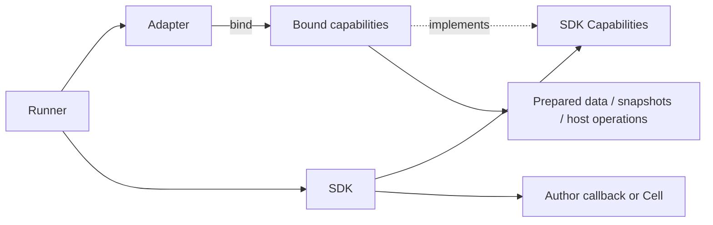

# SDK 能力与运行时适配器统一规范

> 后续变更（2026-10-09）：旧聊天图表执行链按用户确认整体移除，旧消息只显示标题和双语停用提示；[本轮退役记录](legacy-chat-chart-retirement.md)维护审查与验证状态。下文既有实现及验收保留为历史记录。

> 后续结构对齐（2026-10-09）：Strategy TS Context 改由 Runner 显式构造，见 [Context 对齐记录](sdk-context-construction.md)。该记录维护本轮审查与验证状态；下文原装配位置保留为历史事实。

状态：人工 review 已通过，静态检查与行为验证完成；随本提交交付。提交信息：
`refactor(sdk): unify runtime capability adapters`。本轮包含 Factor TS/Python、Strategy TS/Python、Research Python。

## 共同模型

三业务遵循相同职责：Contract 声明作者 API；SDK 实现公开 API、参数校验及辅助逻辑；SDK 自有
Capabilities 声明所需的基础能力；runtime Adapter 通过 bind(input) 将执行环境接成独立的能力绑定；Runner 持有会话 Adapter，创建绑定、注入并执行。
宿主 Runtime/Transport 继续管理协议、隔离和资源。能力适配可读取本地数据，也可访问宿主。



| 角色 | 所有者 | 规则 |
| --- | --- | --- |
| 公开 Contract / 声明 / 文档 | shared/sdk/business | 保留现有唯一来源与生成流程 |
| Capabilities | business/sdk | 强类型接口或 Protocol；不导入 runtime/Engine |
| SDK | business/sdk | 校验和作者辅助；通过注入能力访问运行环境 |
| Adapter | business/runtime/language/adapter.ts 或 .py | 数据映射、快照/缓存/请求/命令；返回实现 SDK 能力的绑定对象 |
| Runner | business/runtime/language/runner.ts 或 .py | 加载源码、绑定 SDK、调用、会话状态和结果边界 |
| 宿主 bridge / dispatch | business/runtime | 校验帧、业务请求、数据权限及回放；不作为 SDK 实现 |
| Transport / sandboxd | infra/runtime 和 apps/sandboxd | 隔离、帧通信、通用限制和资源释放 |

公共装配接口归 [sdk-adapter.ts](../../apps/api/src/infra/runtime/sdk-adapter.ts)，Python 对应
[SdkAdapter Protocol](../../apps/api/src/infra/runtime/python/adapter.py)：

```ts
interface SdkAdapter<Input, Capabilities> {
  bind(input: Input): Capabilities;
}
```

它只约束 Runner 使用的装配入口，不把各业务方法塞进公共接口，也不管理 close/abort。
SDK 仍只依赖本业务能力声明。Adapter 在 session 内复用，返回 Bound*Capabilities；
绑定对象保存当前快照、索引、截面与命令列表，session 缓存／请求编号仍由 Adapter 持有。
Python Strategy 请求编号与 I/O 仍归 Runner，每个 bar 开始重置编号；Research 请求编号跨 namespace reset 保留。

没有跨业务万能 SDK 基类。能力接口保留业务语义和种类关联；纯指标、估值和图表构造继续作为 SDK 本地函数。
SDK 的 Capabilities 是基础能力契约；Research 协议 metadata.capabilities 仍表示协商到的功能标记，线格式保持。

## 三业务的对应落地

| 业务 | SDK 能力 | Adapter | 注入位置 |
| --- | --- | --- | --- |
| Factor | CrossSectionalFactorCapabilities / AssetFactorCapabilities，TS/Python 同名 | FactorAdapter.bind 使用可辨识输入及重载，将预备历史/字段/索引/声明输入绑定为对应能力；无新增通信 | runner 创建 SDK Context(capabilities) |
| Strategy | StrategyCapabilities 与账户能力；TS StrategyDefinition 不继承 Engine 类型 | StrategyAdapter.bind 返回 BoundStrategyCapabilities；账户原始操作与命令编码归 BoundStockAccountCapabilities | TS 定义回调接收能力后 enrich；Python Context(capabilities, params) |
| Research | ResearchCapabilities.request | ResearchAdapter.bind 为 namespace 返回 BoundResearchCapabilities，保留 request/response 和暂停计时器 | create_research_sdk 返回作者对象，ResearchRunner 注入 namespace |

Factor 的 FactorHistory 预备 DTO 移到 runtime/contract.ts；SDK Context 不存储 wire 数据，保留窗口规则、
声明校验、结果有限性和 TS 解构调用。Python 的本地 Adapter 实现字段/索引读取，保持每批次声明集合的寿命。
Strategy TS SDK 的 BarRow/OhlcBar 和公开基础签名从 shared Contract 获取；内部回调定义与能力类型归 SDK，
宿主 EngineContext 在运行边界保持结构兼容。SDK 不通过整体断言把 Engine Context 变成公开 Context。

Research 的 SDK bindings 只创建 data/charts/results/valuation，np/pd 与 namespace、AST、输出、Cell 定义追踪和 reset
归 ResearchRunner。与 Factor/Strategy 相同，run_research 仅创建 → 启动 → 接入 handler；公共 jixie_runner.py
驱动消息循环。池、串行排队、容量、文档权限、输入回放和嵌入版本/留痕保持原有归属。

## 跨业务和语言的阅读顺序

Adapter 文件统一为：输入／状态声明 → Adapter.bind → Bound*Capabilities → 缓存与通信。
Factor 的两种语言均先横截面能力、再资产能力；重载保留输入与能力的关联，不把返回值降为 Any。
Strategy 的两种语言使用同名 StrategyAdapterAccess、StrategyAdapterInput、StrategyStockSnapshot、StrategyFuturesSnapshot，均先账户能力、再当日市场能力；共同方法排列为日期／账户、截面、bar、ensureBars、bars、history、price、基础属性／factor。
TS 的额外指数、重采样、期货能力放在共同部分之后，Python 不新增尚未支持的方法。
Research 只有 Python，采用同一 bind／独立能力绑定模式，namespace 与第三方模块仍由 Runner 持有。

Strategy SDK 两种语言都只转发原始账户能力；命令名和参数编码只在 Adapter。
SDK 的 equalWeight、指标、Universe 等辅助逻辑继续本地计算。TS stock 不再依靠 spread 原始对象枚举方法，
显式转发保证类方法和公开方法解构可用；实时权益 getter 保持。Python commands 属于当日绑定，Runner 在 done 中取出。

## 兼容与边界

作者工厂、回调、ctx 方法、data/results/valuation/charts、生成声明、公开帮助和语言能力保持。
内部 Context 构造改为能力注入，它们不是新增的作者构造入口。没有 HTTP、数据库、字段口径或 PIT 变化。
保留 TS/Python 既有窗口/未知字段/同步异步差异、调用处错误、首次读缓存、历史增量、Python done 后命令重放、
Research namespace 插入顺序、参数/错误后会话与 reset 行为。新类/路径会改变内部 traceback 栈位置。

历史 Agent JS 图表保留 export default ({ data, stats }) => result 和 loadIsolatedModule/callJson 的兼容链路；
data 是预备输入，stats 是本地 helper，可以按同样职责阅读。此次不创建新的作者 SDK 或改变历史存储源码。
只读 SQL 的权限/超时属于宿主查询边界；后台 Worker、Pyright/Monaco 不作为独立计算 SDK。

## 部署与验证

SDK 的能力文件、Factor Python Adapter、Strategy 重命名 Adapter、Research 重命名 Adapter/capabilities 及 bindings、公共 Python SdkAdapter Protocol
逐项进入 Dockerfile、.dockerignore 和 component-impact.json，业务 Python 同时影响 API/sandboxd；通用入口归 sandboxd。
部署计划测试同步。无需新 workspace 或第三方依赖。

审查前只运行全仓 typecheck（生成物与 TS 边界）、Python SDK AST 所有权检查、Python 3.13 静态编译/Pyright、
lint/format、镜像输入/链接和 diff 静态检查。新增测试验证 SDK 可用假能力独立工作、无 runtime/Engine 导入，
Factor 拷贝/解构/校验顺序、Strategy 账户 live 值和公开边界、Research 绑定与 reset。

人工 review 后运行三业务 SDK/runtime、Research pool/依赖/嵌入分析、相关 Engine/消费者、公共通信、部署/边界自测、
打包、源码/编译 Worker 和构建；实际结果见下方验证记录，临时会话与数据库按测试生命周期释放。


## 审查前静态结果

本轮按 review 反馈完成跨业务 bind 入口、Strategy 输入／快照类型、会话缓存与当次绑定归属，
以及 Python Strategy 原始账户能力／命令编码对齐。

全仓 pnpm typecheck 通过：887 个后端文件、0 边界违规、SDK 生成物一致，全部 workspace 类型通过。
修改的 26 个 TS/MJS/JSON 文件 Prettier 通过，相关 TS/MJS ESLint 0 警告。
Python SDK 边界检查覆盖 11 个文件，0 违规；23 个源文件与 3 段测试内嵌脚本静态编译通过；
16 个 SDK/Adapter/Runner/公共入口文件 Pyright 0 错误／警告（Python 3.13，显式 API src 搜索路径）。
22 个镜像 Python 输入均存在并显式允许进入构建上下文，所有 API Python 输入同时列入 API/sandboxd 部署影响。
236 个本地 Markdown 链接有效，git diff --check 通过。

准备的回归覆盖 Factor 重复绑定与索引独立、Strategy 历史延续／读缓存失效／当日截面与命令隔离、
TS SDK 类账户方法与解构／即时 host 命令、Python 原始账户命令编码、Research 多次 bind 后请求编号延续。
原 Research 打包回归继续覆盖语法错误后执行、namespace reset、SDK 重绑定与请求编号递增。
这些回归及三业务既有 SDK/runtime、公共通信、消费者、源码／编译 Worker 与构建在人工 review 通过后执行，结果如下。

## Review 后验证结果

2026-10-09 用户确认代码 review 并授权继续验证和提交。所有必要验证最终通过，未修改产品代码或测试断言：

| 验证 | 结果 |
| --- | --- |
| SDK 注入、Adapter 绑定、镜像显式输入打包、TS bundle 边界 | 16 个文件、51 个用例通过 |
| Factor/Strategy/Research runtime、执行消费者、Engine、Research 文档／依赖／嵌入分析、历史图表 | 77 个文件、514 个用例最终通过；其中 Research pool 单独重跑 16 个用例 |
| PythonSession 实际临时 Unix socket 分帧／异常／回收 | 11 个用例通过 |
| sandboxd 模拟 Docker/Podman 生命周期及回收 | 8 个用例通过 |
| TS/Python SDK 边界检查器与部署计划自测 | 50 个用例通过 |
| 隔离数据库、源码 Worker 的四种策略／因子语言组合、扫描、错误路径与退出 | 14 个用例通过 |
| 同一组 Worker 的 dist 生产入口 | 14 个用例通过 |
| 编译后的三种 Factor entry/runner/adapter/SDK bundle 与计算 | 3 个用例通过 |
| shared / API / sandboxd 构建 | 全部通过 |

初次 Research pool 验证触发测试启动超时：本环境的默认 Matplotlib 缓存目录不可写，
每个 Python 进程重建字体缓存，实测包初始化约 7.53 秒，超过原有 5 秒测试期限。
单独增加测试期限后仍影响取消／四会话用例的内部等待与执行预算。随后为验证创建临时可写 MPLCONFIGDIR，
预备一次字体缓存，包初始化降至 0.34 秒；16 个用例在原有 5 秒测试期限下全部通过，
取消和容量用例分别约 0.89 秒／1.79 秒。未放宽产品超时、容量规则或测试断言，临时缓存验证后删除。

构建与资源验证覆盖源码、dist、显式镜像输入复制；本轮未构建或启动真实 Docker/Podman 镜像。
测试使用隔离 SQLite，Worker、Python 会话、临时 socket 和模拟 daemon 均随测试关闭；未启动 API/Web 服务。
