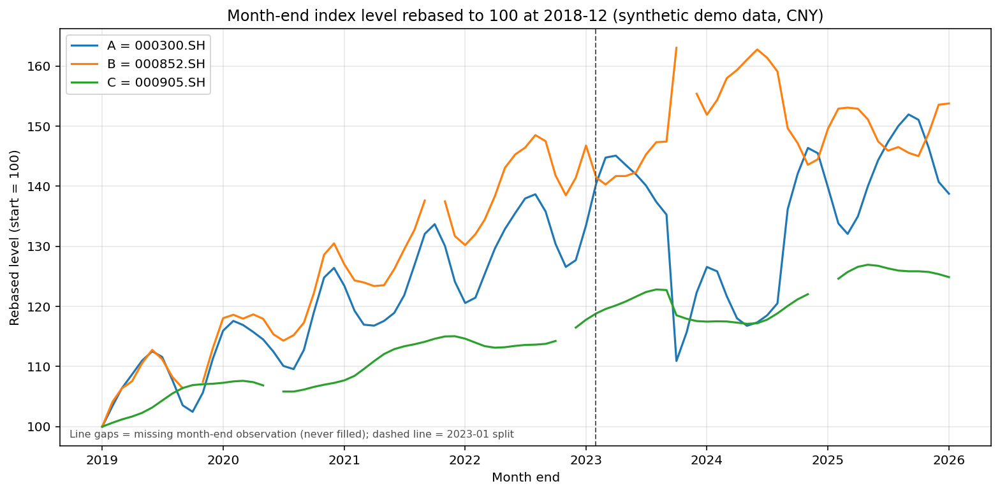
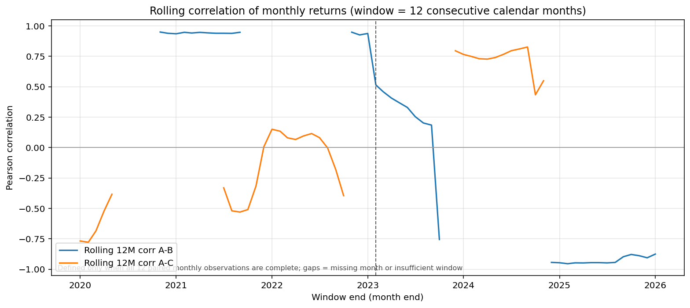

# 复杂分析的验收复核

本次使用已修正工具说明的真实 Strategy Agent。6 次模型调用，2 次 Python 执行（第一次失败后修正同一分析），最后成功版本冻结。策略代码未改变；成功运行的 3 份 SDK 输入及内容均已保留。全部计算来自合成月末价格，不是真实指数表现。

## 数值与代码

- [51 个完整精度指标](numerical-checks.json)与独立 TypeScript 参考一致，包括缺失和有效样本数、样本年化波动、分位数、两组成对统计的三个区间、Pearson、Spearman、含截距 OLS。
- [模型原始代码](model-cell.py)先建立完整自然月网格，再计算相邻月份价格比值减 1，没有填充缺失或用价格差冒充收益率。两组分段掩码在相同索引上构造，修正了第一次的 84/85 形状错误。
- 对滚动窗口另外复核了数量、首末月份、最小值、最大值和均值。A/B 有 37 个完整窗口，A/C 有 33 个；均与实际 stdout 一致。[逐窗口独立复核](method-review.json)保留了每个有效窗口的值。代码严格按连续 12 个自然月取窗，缺失处输出 NaN。
- 展示表保留六位小数；真正用于核对的 AUDIT_JSON 保留原始精度。代码里表格打印前的 “no rounding applied” 描述不准确，应理解为审计 JSON 未舍入，不能套用到展示表。

## 图形

两张 PNG 均直接导出自真实 Python 运行的 ResearchArtifact，未重画、未修改模型源代码。已目视检查：价格图起点归一、缺失处断开；相关图范围正确、窗口不足处断开、英文标签可读。

第二张图左下角图例遮住了部分底部补充说明，标题和曲线仍可读。这是原始模型图的排版不足，原样保留；不把它包装成已排版完善的出版图。

## 可以得出的结论

在这份合成样本内，A/B 的全样本 Pearson 约 -0.150，而 2023 年前后分别约 +0.945 和 -0.955。全样本单一系数掩盖了分段关系，不能据此认定 B 具有稳定的分散能力。

A/C 全样本 Pearson 约 +0.453、Spearman 约 +0.090。两者差异提示需要检查极端观测，单凭差异不能确定原因。验收时补充做了一个独立诊断：剔除预先已知的合成冲击月 2023-09 后，A/C Pearson 从 0.45260 降到 0.09588（77 对观测变为 76 对）。这支持该月份对本样本线性相关的影响较大；它是审查补充计算，**不是模型原 Cell 已完成的额外检验**，也不是建议删除该月来选取更好的结果。

## 对模型原文的限定

[模型原始解释](model-answer.md)未改写。阅读时应同时保留以下限定：

- “尺度/尾部效应”中，波动率量级不同本身不会改变 Pearson 相关系数；相关系数对正的常数缩放不变。beta 和组合波动则受尺度影响。
- “事前无法知道当前体制”说得过满。本例没有验证状态预测能力，只能说尚未建立并验证识别方法。
- 代码输出中 “清理后的 12 条收益覆盖更少月份” 是措辞错误：清除缺月后，12 条记录可能跨越更多自然月。实际滚动实现和独立复核采用完整自然月网格，计算没有受这句错误说明影响。
- 合成例子的结果不能外推到真实标的；没有组合权重、成本、可交易性、样本外或正式断点检验，不能据此提出已验证的交易结论。

**冻结表示这次执行的代码、输入和输出可以追溯，并不表示其方法和结论自动通过研究审查。** 本例证明协议与受控复杂流程可以完成；先前失败记录仍保留，不据一次通过宣称新模型的普遍质量或胜率。
